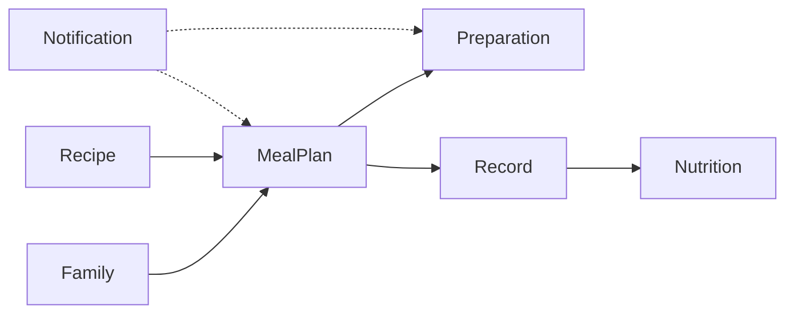

# 业务领域划分

<!--
  与 ARCHITECTURE.md 的区别：
  - ARCHITECTURE.md = 技术架构（分层、依赖方向、技术栈），相对稳定
  - 本文件 = 业务领域（领域边界、职责、实体），随业务演进变化

  修改本文件不需要架构 RFC，但需要更新 AGENTS.md 中的导航链接。
-->

## 领域清单

| 领域 | 职责说明 | 代码位置 | 关键实体 |
|------|----------|----------|----------|
| Family | 家庭成员、偏好、忌口、权限、画像配置 | `domain/family/` | FamilyProfile, FamilyMember, MemberPreference |
| Recipe | 菜品、配方、标签、营养信息、分类 | `domain/recipe/` | Recipe, RecipeIngredient, RecipeStep, NutritionFact |
| MealPlan | 周计划、餐次安排、生成规则、重复校验 | `domain/mealplan/` (planned) | WeeklyMealPlan |
| Preparation | 采购清单、备菜计划、保存方式 | `domain/preparation/` (planned) | PrepPlan, ShoppingList |
| Record | 照片记录、备注、计划关联、差异比对 | `domain/record/` (planned) | MealRecord |
| Nutrition | 营养报告、达标校验、建议输出 | `domain/nutrition/` (planned) | NutritionReport |
| Notification | 提醒配置、定时任务、消息投递 | `domain/notification/` (planned) | NotifyTask |

## 领域间关系

## 领域通信规则

- 领域之间不允许循环依赖
- 跨领域通信通过 App 层编排，Domain 层不直接跨域调用
- 采购清单统一命名 `ShoppingList`，禁用 `PurchaseList`
- 提醒任务统一命名 `NotifyTask`，禁用 `Reminder`、`Task`
