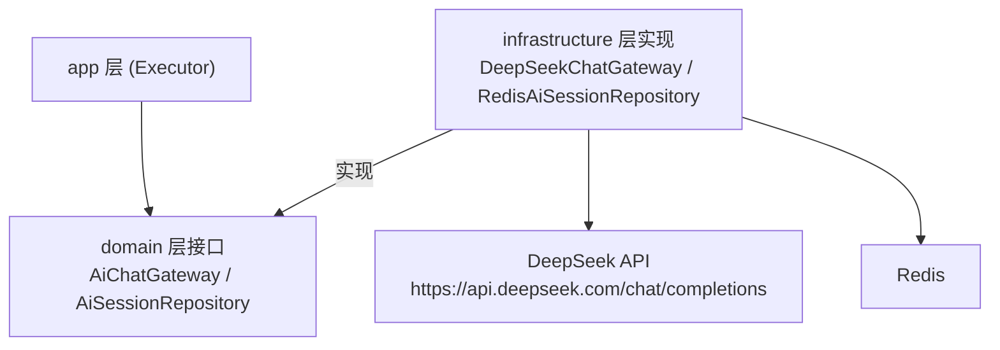

# Phase 1: DeepSeek LLM 调用基础设施

## Context

MealMate 需要集成 DeepSeek LLM 实现智能菜品录入和饮食计划生成（见 `llm-integration/roadmap.md`）。当前项目无任何 LLM 调用能力。Phase 1 的目标是在 infrastructure 层建立通用的 LLM 网关，供后续 Phase 2/3 的业务编排使用。

项目使用 Spring Boot 3.3.13，Spring AI 不兼容（需 Boot 3.4+），因此采用 RestClient 直接调用 DeepSeek OpenAI 兼容接口。

## Goal

在 infrastructure 层交付一个可工作的 DeepSeek 调用网关 + 会话存储实现，通过 domain 层接口暴露能力，使 app 层可以编排 LLM 调用。WireMock 单测全部通过。

## Non-Goal

- 不实现菜品解析或计划生成的业务逻辑（Phase 2/3）
- 不实现流式输出 SSE（Phase 4）
- 不实现自动重试/断路器（Phase 4）
- 不实现 Prompt 模板管理（跟随 Phase 2 按需引入）

## Architecture



**依赖方向：**
- `app → domain`（调用 domain 接口）
- `infrastructure → domain`（实现 domain 接口）
- `start → infrastructure`（装配）

完全遵守 ARCHITECTURE.md §6 的依赖方向约束。无 `app → infrastructure`。

**数据流转：**
```
App Executor → domain.AiChatGateway.chat(AiChatRequest) → infrastructure.DeepSeekChatGateway
  → RestClient → DeepSeek API → ChatResponse → domain.AiChatResult
```

## Interface Contract

### Domain 层接口（`mealmate-domain`）

#### `AiChatGateway`

```java
package io.yggdrasil.labs.mealmate.domain.common.ai;

/**
 * AI 聊天网关接口。Domain 层定义，Infrastructure 层实现。
 * 职责：发送对话消息给 LLM，返回回复内容。
 */
public interface AiChatGateway {

    /**
     * 发送聊天请求。
     *
     * @param request 聊天请求（含消息列表和配置）
     * @return 聊天结果（含回复文本和 token 用量）
     */
    AiChatResult chat(AiChatRequest request);
}
```

#### `AiChatRequest`（Domain 值对象）

```java
package io.yggdrasil.labs.mealmate.domain.common.ai;

import lombok.Builder;
import lombok.Value;

/** AI 聊天请求（不可变值对象）。 */
@Value
@Builder
public class AiChatRequest {
    /** 对话消息列表（role + content） */
    List<AiMessage> messages;
    /** 是否要求 JSON 格式输出 */
    boolean jsonMode;
    /** 温度（null 表示使用默认值） */
    Double temperature;
    /** 最大输出 token 数（null 表示使用默认值） */
    Integer maxTokens;
}
```

#### `AiMessage`（Domain 值对象）

```java
package io.yggdrasil.labs.mealmate.domain.common.ai;

import lombok.Value;

/** AI 对话消息（不可变值对象）。 */
@Value
public class AiMessage {
    AiRole role;
    String content;

    public enum AiRole {
        SYSTEM, USER, ASSISTANT
    }
}
```

#### `AiChatResult`（Domain 值对象）

```java
package io.yggdrasil.labs.mealmate.domain.common.ai;

import lombok.Builder;
import lombok.Value;

/** AI 聊天结果（不可变值对象）。 */
@Value
@Builder
public class AiChatResult {
    String content;
    int promptTokens;
    int completionTokens;
    int totalTokens;
    String finishReason;
}
```

#### `AiSessionRepository`（Domain 仓储接口）

```java
package io.yggdrasil.labs.mealmate.domain.common.ai;

/**
 * AI 对话会话仓储接口。Domain 层定义，Infrastructure 层实现。
 */
public interface AiSessionRepository {

    String create(AiSession session);

    Optional<AiSession> findById(String sessionId);

    void update(AiSession session);

    void delete(String sessionId);
}
```

#### `AiSession`（Domain 实体）

Phase 1 仅保留通用会话管理字段，业务状态（type/status/parsedResult）推迟到 Phase 2 引入。

```java
package io.yggdrasil.labs.mealmate.domain.common.ai;

import lombok.Builder;
import lombok.Getter;

/**
 * AI 对话会话。
 * 通过领域方法变更状态，不暴露 setter。
 */
@Getter
@Builder
public class AiSession {
    private final String sessionId;
    private final List<AiMessage> messages;
    private final LocalDateTime createdAt;
    private LocalDateTime updatedAt;

    /** 追加一轮对话（user + assistant） */
    public void addTurn(AiMessage userMessage, AiMessage assistantReply) {
        this.messages.add(userMessage);
        this.messages.add(assistantReply);
        this.updatedAt = LocalDateTime.now();
    }

    /** 当前对话轮次（user 消息数量） */
    public int turnCount() {
        return (int) messages.stream()
                .filter(m -> m.getRole() == AiMessage.AiRole.USER)
                .count();
    }

    /** 获取完整消息列表（含 system prompt） */
    public List<AiMessage> allMessages() {
        return List.copyOf(messages);
    }
}
```

### Infrastructure 层实现（`mealmate-infrastructure`）

#### `DeepSeekChatGateway`

```java
package io.yggdrasil.labs.mealmate.infrastructure.ai.deepseek;

@Component
@RequiredArgsConstructor
@Slf4j
public class DeepSeekChatGateway implements AiChatGateway {

    private final RestClient deepSeekRestClient;
    private final DeepSeekProperties properties;

    @Override
    public AiChatResult chat(AiChatRequest request) {
        // 1. domain AiMessage → infra ChatCompletionRequest (内部DTO转换)
        // 2. POST /chat/completions，Header: Authorization: Bearer {apiKey}
        // 3. 解析 ChatCompletionResponse → domain AiChatResult
        // 4. 结构化日志：model/tokens/latency
        // 异常：HTTP 4xx/5xx/超时 → throw new BizException(AiErrorCode.xxx)
    }
}
```

#### `DeepSeekConfig`（RestClient Bean 装配）

```java
package io.yggdrasil.labs.mealmate.infrastructure.ai.deepseek;

@Configuration
@EnableConfigurationProperties(DeepSeekProperties.class)
public class DeepSeekConfig {

    @Bean
    public RestClient deepSeekRestClient(DeepSeekProperties properties) {
        SimpleClientHttpRequestFactory factory = new SimpleClientHttpRequestFactory();
        factory.setConnectTimeout(Duration.ofSeconds(5));
        factory.setReadTimeout(Duration.ofSeconds(properties.getTimeoutSeconds()));

        return RestClient.builder()
                .baseUrl(properties.getBaseUrl())
                .defaultHeader("Authorization", "Bearer " + properties.getApiKey())
                .defaultHeader("Content-Type", "application/json")
                .requestFactory(factory)
                .build();
    }
}
```

#### Infrastructure 内部 DTO（不出 infrastructure 层边界）

```java
package io.yggdrasil.labs.mealmate.infrastructure.ai.deepseek.dto;

/** 对齐 OpenAI /chat/completions 请求格式 */
@Data
@Builder
public class ChatCompletionRequest {
    private String model;
    private List<MessageItem> messages;
    @JsonProperty("response_format")
    private ResponseFormat responseFormat;
    @JsonProperty("max_tokens")
    private Integer maxTokens;
    private Double temperature;

    @Data @AllArgsConstructor
    public static class MessageItem {
        private String role;
        private String content;
    }

    @Data @AllArgsConstructor
    public static class ResponseFormat {
        private String type;  // "json_object" | "text"
    }
}

/** 对齐 OpenAI /chat/completions 响应格式 */
@Data
public class ChatCompletionResponse {
    private String id;
    private List<Choice> choices;
    private Usage usage;

    @Data
    public static class Choice {
        private int index;
        private MessageItem message;
        @JsonProperty("finish_reason")
        private String finishReason;
    }

    @Data
    public static class MessageItem {
        private String role;
        private String content;
    }

    @Data
    public static class Usage {
        @JsonProperty("prompt_tokens")
        private int promptTokens;
        @JsonProperty("completion_tokens")
        private int completionTokens;
        @JsonProperty("total_tokens")
        private int totalTokens;
    }
}
```

#### `DeepSeekProperties`

```java
package io.yggdrasil.labs.mealmate.infrastructure.ai.deepseek;

@ConfigurationProperties(prefix = "mealmate.ai.deepseek")
@Data
public class DeepSeekProperties {
    private String baseUrl = "https://api.deepseek.com";
    private String apiKey;
    private String model = "deepseek-v4-flash";
    private int timeoutSeconds = 30;
    private int maxTokens = 4096;
    private double temperature = 0.7;
}
```

#### `RedisAiSessionRepository`

```java
package io.yggdrasil.labs.mealmate.infrastructure.ai.session;

@Component
@RequiredArgsConstructor
public class RedisAiSessionRepository implements AiSessionRepository {
    // KEY: "ai:session:{sessionId}"
    // TTL: 30 分钟
    // 使用 StringRedisTemplate + 独立 ObjectMapper 实例
    // LocalDateTime 序列化格式: ISO-8601 (JavaTimeModule)
    // AiSession → JSON string → Redis SET with TTL
    // 不引入 AiSessionDO：AiSession 字段简单，直接 Jackson 序列化
    //   （domain 对象不带 Jackson 注解，ObjectMapper 通过 mixin 或字段名约定处理）

    private final StringRedisTemplate redisTemplate;
    private final ObjectMapper aiSessionMapper;  // 独立实例，由 AiSessionConfig 装配

    private static final String KEY_PREFIX = "ai:session:";
    private static final Duration TTL = Duration.ofMinutes(30);
}
```

#### `AiSessionConfig`（Redis ObjectMapper 装配）

```java
package io.yggdrasil.labs.mealmate.infrastructure.ai.session;

@Configuration
public class AiSessionConfig {

    @Bean
    public ObjectMapper aiSessionMapper() {
        return new ObjectMapper()
                .registerModule(new JavaTimeModule())
                .disable(SerializationFeature.WRITE_DATES_AS_TIMESTAMPS);
    }
}
```

### 配置变更

**application.yml 新增：**
```yaml
mealmate:
  ai:
    deepseek:
      base-url: https://api.deepseek.com
      api-key: ${DEEPSEEK_API_KEY:}
      model: deepseek-v4-flash
      timeout-seconds: 30
      max-tokens: 4096
      temperature: 0.7

spring:
  data:
    redis:
      host: ${REDIS_HOST:localhost}
      port: ${REDIS_PORT:6379}
```

**mealmate-infrastructure/pom.xml 新增：**
```xml
<dependency>
    <groupId>org.springframework.boot</groupId>
    <artifactId>spring-boot-starter-data-redis</artifactId>
</dependency>
```

## Data Model

无数据库表变更。会话数据存储在 Redis（TTL 30 分钟自动过期），不持久化到 MySQL。

Redis 数据结构：
```
Key:   ai:session:{uuid}
Value: JSON(AiSession)
TTL:   30 minutes
```

## Non-Functional Requirements

| 维度 | 指标 |
|------|------|
| 性能 | DeepSeek 调用 P95 < 10s（受上游 API 限制） |
| 可用性 | LLM 不可用时抛出 BizException，不影响其他功能 |
| 安全 | API Key 通过环境变量注入，不进入代码/日志/配置文件 |
| 可观测性 | 每次调用记录结构化日志：model、tokens、latency、success/error |
| 会话容量 | 单会话最大 10 轮对话，30 分钟过期 |

## Alternatives Considered

| 方案 | 优点 | 缺点 | 不选原因 |
|------|------|------|----------|
| Spring AI SDK | 开箱即用，生态完整 | 需 Boot 3.4+，与 mimir-boot-parent 2.0.4 不兼容 | 版本冲突无法解决，除非升级 parent |
| OpenAI Java SDK | 官方维护 | 引入额外依赖，且与 DeepSeek 的兼容性需验证 | RestClient 足够，不需要额外 SDK |
| WebClient (Reactive) | 原生支持 SSE | 项目是 Servlet 栈，引入 reactive 增加复杂度 | Phase 4 SSE 时再评估 |

## Error Handling

| 失败场景 | 处理策略 |
|---------|---------|
| DeepSeek API 返回 401 | 抛出 `BizException(AiErrorCode.AI_AUTH_FAILURE)`，日志 ERROR |
| DeepSeek API 返回 429 | 抛出 `BizException(AiErrorCode.AI_RATE_LIMITED)`，日志 WARN |
| DeepSeek API 返回 5xx | 抛出 `BizException(AiErrorCode.AI_SERVICE_UNAVAILABLE)`，日志 ERROR |
| 网络超时 | 抛出 `BizException(AiErrorCode.AI_SERVICE_UNAVAILABLE)`，日志 ERROR |
| 响应 JSON 解析失败 | 抛出 `BizException(AiErrorCode.AI_RESPONSE_INVALID)`，日志 ERROR |
| Redis 连接失败 | Spring RedisConnectionException 向上传播，由全局异常处理器兜底 |
| 会话不存在/过期 | 返回 `Optional.empty()`，由 app 层决定行为 |

异常码定义（新增 `domain.common.ai.AiErrorCode`，遵循 `MealPlanErrorCode` 模式）：
```java
package io.yggdrasil.labs.mealmate.domain.common.ai;

import io.yggdrasil.labs.mealmate.domain.common.exception.BizException;

/** AI 能力相关错误码。 */
public enum AiErrorCode implements BizException.ErrorCode {
    AI_AUTH_FAILURE("AI_AUTH_FAILURE", "AI 服务认证失败"),
    AI_RATE_LIMITED("AI_RATE_LIMITED", "AI 服务请求频率超限"),
    AI_SERVICE_UNAVAILABLE("AI_SERVICE_UNAVAILABLE", "AI 服务暂不可用"),
    AI_RESPONSE_INVALID("AI_RESPONSE_INVALID", "AI 响应格式异常"),
    AI_SESSION_NOT_FOUND("AI_SESSION_NOT_FOUND", "会话不存在或已过期"),
    ;

    private final String code;
    private final String message;

    AiErrorCode(String code, String message) {
        this.code = code;
        this.message = message;
    }

    @Override
    public String getCode() { return code; }

    @Override
    public String getMessage() { return message; }
}
```

## Testing Strategy

| 测试对象 | 层级 | 验证方法 | 通过标准 |
|---------|------|---------|---------|
| DeepSeekChatGateway — 正常 | 单元 | WireMock 模拟 200 响应 | 正确解析为 AiChatResult，token 数正确 |
| DeepSeekChatGateway — 401 | 单元 | WireMock 模拟 401 | 抛出 BizException(AI_AUTH_FAILURE) |
| DeepSeekChatGateway — 429 | 单元 | WireMock 模拟 429 | 抛出 BizException(AI_RATE_LIMITED) |
| DeepSeekChatGateway — 500 | 单元 | WireMock 模拟 500 | 抛出 BizException(AI_SERVICE_UNAVAILABLE) |
| DeepSeekChatGateway — 超时 | 单元 | WireMock delay > timeout | 抛出 BizException(AI_SERVICE_UNAVAILABLE) |
| DeepSeekChatGateway — jsonMode | 单元 | WireMock 验证请求体 | request body 包含 response_format.type=json_object |
| RedisAiSessionRepository — CRUD | 集成 | Testcontainers Redis | create→find 返回相同数据；update 覆盖；delete 后 find 返回 empty |
| RedisAiSessionRepository — TTL | 集成 | Testcontainers Redis + 等待过期 | TTL 到期后 find 返回 empty |
| AiSession — addTurn | 单元 | 直接调用 | messages 追加 2 条；turnCount 递增；updatedAt 更新 |
| 编译兼容性 | 构建 | `./mvnw clean compile` | 编译无错误 |
| 回归 | 构建 | `./mvnw test` | 现有测试全部通过 |

## Milestones

| 阶段 | 产出 | 依赖 |
|------|------|------|
| 1a | Domain 层接口 + 值对象 + 异常码 | 无 |
| 1b | Infrastructure 层 DeepSeekChatGateway + DTO + Config | 1a |
| 1c | Infrastructure 层 RedisAiSessionRepository | 1a、Redis 依赖引入 |
| 1d | 单元测试 + 集成测试 | 1b、1c |
| 1e | 配置文件变更 + 编译验证 | 1b、1c |
