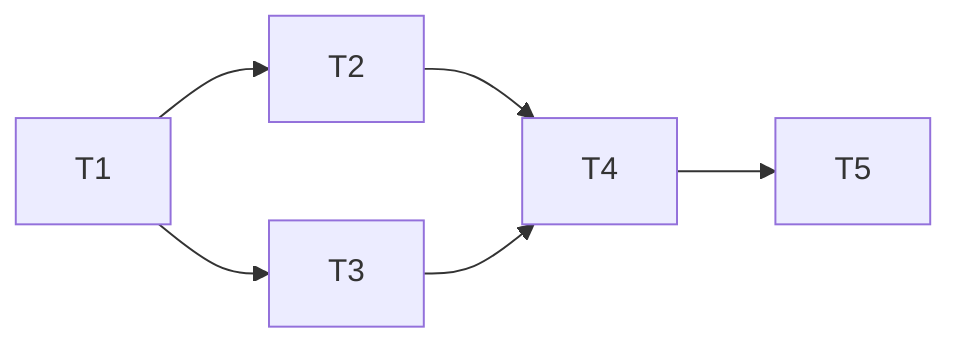

# Phase 1: DeepSeek LLM 调用基础设施

**Branch:** feature/llm-infrastructure
**Baseline SHA:** 2f8b350
**Started At:** 2026-06-27
**Updated At:** 2026-06-27

**Goal:** 在 infrastructure 层交付可工作的 DeepSeek 调用网关 + Redis 会话存储，通过 domain 接口暴露能力。
**Architecture:** domain 层定义 AiChatGateway / AiSessionRepository 接口与值对象；infrastructure 层通过 RestClient 调用 DeepSeek API 并用 Redis 存储会话；app 层仅依赖 domain 接口。
**Tech Stack:** RestClient, Jackson, Spring Data Redis, WireMock, Testcontainers

## Dependency Graph



| Task | 依赖 | 可并行组 |
|------|------|---------|
| T1: Domain 层接口与值对象 | 无 | A |
| T2: DeepSeek 网关实现 | T1 | B |
| T3: Redis 会话存储实现 | T1 | B |
| T4: 配置与装配 | T2, T3 | C |
| T5: 编译验证与回归 | T4 | D |

---

### T1: Domain 层接口与值对象

**Depends on:** 无

**Files:**
- Create: `mealmate-domain/src/main/java/io/yggdrasil/labs/mealmate/domain/common/ai/AiMessage.java`
- Create: `mealmate-domain/src/main/java/io/yggdrasil/labs/mealmate/domain/common/ai/AiChatRequest.java`
- Create: `mealmate-domain/src/main/java/io/yggdrasil/labs/mealmate/domain/common/ai/AiChatResult.java`
- Create: `mealmate-domain/src/main/java/io/yggdrasil/labs/mealmate/domain/common/ai/AiChatGateway.java`
- Create: `mealmate-domain/src/main/java/io/yggdrasil/labs/mealmate/domain/common/ai/AiSession.java`
- Create: `mealmate-domain/src/main/java/io/yggdrasil/labs/mealmate/domain/common/ai/AiSessionRepository.java`
- Create: `mealmate-domain/src/main/java/io/yggdrasil/labs/mealmate/domain/common/ai/AiErrorCode.java`
- Test: `mealmate-domain/src/test/java/io/yggdrasil/labs/mealmate/domain/common/ai/AiSessionTest.java`

**Behavior:**
定义 AI 能力的 domain 层契约：聊天网关接口、会话仓储接口、不可变值对象和错误码枚举。AiSession 通过 addTurn() 方法管理对话历史。

**Execution:**
- **Status:** done
- **Commit SHA:** 45232be
- **Attempts:** 1
- **Blocked Reason:** null

- [x] **Step 1: Confirm baseline**

7 个文件均为不可变值对象/接口/枚举，签名见 design.md Interface Contract：
- `AiMessage`: `@Value` + `AiRole` 内部枚举（SYSTEM, USER, ASSISTANT）
- `AiChatRequest`: `@Value @Builder`（messages, jsonMode, temperature, maxTokens）
- `AiChatResult`: `@Value @Builder`（content, promptTokens, completionTokens, totalTokens, finishReason）
- `AiChatGateway`: 单方法接口 `AiChatResult chat(AiChatRequest)`
- `AiSession`: `@Getter @Builder` + `addTurn()`/`turnCount()`/`allMessages()`
- `AiSessionRepository`: CRUD 四方法接口
- `AiErrorCode`: `implements BizException.ErrorCode`，5 个枚举值

- [x] **Step 3: Verify**

Run: `./mvnw test -pl mealmate-domain -Dtest=AiSessionTest -am -Dsurefire.failIfNoSpecifiedTests=false`
Expected: **PASS**

- [x] **Step 4: Commit**

`feat(domain): 新增 AI 能力 domain 层接口与值对象`

---

### T2: DeepSeek 网关实现

**Depends on:** T1

**Files:**
- Create: `mealmate-infrastructure/src/main/java/io/yggdrasil/labs/mealmate/infrastructure/ai/deepseek/dto/ChatCompletionRequest.java`
- Create: `mealmate-infrastructure/src/main/java/io/yggdrasil/labs/mealmate/infrastructure/ai/deepseek/dto/ChatCompletionResponse.java`
- Create: `mealmate-infrastructure/src/main/java/io/yggdrasil/labs/mealmate/infrastructure/ai/deepseek/DeepSeekProperties.java`
- Create: `mealmate-infrastructure/src/main/java/io/yggdrasil/labs/mealmate/infrastructure/ai/deepseek/DeepSeekConfig.java`
- Create: `mealmate-infrastructure/src/main/java/io/yggdrasil/labs/mealmate/infrastructure/ai/deepseek/DeepSeekChatGateway.java`
- Test: `mealmate-infrastructure/src/test/java/io/yggdrasil/labs/mealmate/infrastructure/ai/deepseek/DeepSeekChatGatewayTest.java`

**Behavior:**
通过 RestClient 调用 DeepSeek /chat/completions 端点，将 domain AiChatRequest 转为 HTTP 请求，解析响应为 AiChatResult。对 4xx/5xx/超时分别抛出对应 BizException。记录结构化日志。

**Execution:**
- **Status:** done
- **Commit SHA:** ae26f89
- **Attempts:** 1
- **Blocked Reason:** null

- [x] **Step 1: Confirm baseline**
- [x] **Step 2: Implement**

`DeepSeekChatGateway.chat()` 核心流程：
```
1. List<AiMessage> → List<MessageItem>（AiRole enum → "system"/"user"/"assistant"）
2. 构建 ChatCompletionRequest（model/messages/temperature/maxTokens/responseFormat）
3. restClient.post().uri("/chat/completions").body(request).retrieve().body(ChatCompletionResponse.class)
4. 捕获 HttpClientErrorException:
   - 401 → BizException(AI_AUTH_FAILURE)
   - 429 → BizException(AI_RATE_LIMITED)
   - 其他 → BizException(AI_SERVICE_UNAVAILABLE)
5. 捕获 ResourceAccessException → BizException(AI_SERVICE_UNAVAILABLE)
6. 解析 response.choices[0].message.content → AiChatResult
7. log.info("[DeepSeek] model={} tokens={prompt:{},completion:{},total:{}} latency={}ms")
```

`DeepSeekConfig`: 装配 RestClient Bean（baseUrl + Authorization header + timeout）。
`DeepSeekProperties`: `@ConfigurationProperties(prefix = "mealmate.ai.deepseek")`。

- [x] **Step 3: Verify**

Run: `./mvnw test -pl mealmate-infrastructure -Dtest=DeepSeekChatGatewayTest -am -Dsurefire.failIfNoSpecifiedTests=false`
Expected: **PASS** — 正常/401/429/500/超时 5 个场景全部通过

- [x] **Step 4: Commit**

`feat(infra): 实现 DeepSeek 聊天网关（RestClient + WireMock 测试）`

---

### T3: Redis 会话存储实现

**Depends on:** T1

**Files:**
- Modify: `mealmate-infrastructure/pom.xml`
- Create: `mealmate-infrastructure/src/main/java/io/yggdrasil/labs/mealmate/infrastructure/ai/session/AiSessionConfig.java`
- Create: `mealmate-infrastructure/src/main/java/io/yggdrasil/labs/mealmate/infrastructure/ai/session/RedisAiSessionRepository.java`
- Test: `mealmate-infrastructure/src/test/java/io/yggdrasil/labs/mealmate/infrastructure/ai/session/RedisAiSessionRepositoryTest.java`

**Behavior:**
使用 StringRedisTemplate + 独立 ObjectMapper 将 AiSession 序列化为 JSON 存储到 Redis，支持 30 分钟 TTL 自动过期。

**Execution:**
- **Status:** done
- **Commit SHA:** 26dc191
- **Attempts:** 1
- **Blocked Reason:** null

- [x] **Step 1: Confirm baseline**
- [x] **Step 2: Implement**

pom.xml 新增：
```xml
<dependency>
    <groupId>org.springframework.boot</groupId>
    <artifactId>spring-boot-starter-data-redis</artifactId>
</dependency>
```

`RedisAiSessionRepository` 核心：
```
- create: UUID.randomUUID → session.sessionId → serialize → SET "ai:session:{id}" TTL 30min
- findById: GET → null? empty : deserialize
- update: session.updatedAt = now → serialize → SET key TTL（覆盖+刷新）
- delete: DEL key
```

`AiSessionConfig`: 独立 `@Bean ObjectMapper aiSessionMapper`（JavaTimeModule + ISO-8601）。

- [x] **Step 3: Verify**

Run: `./mvnw test -pl mealmate-infrastructure -Dtest=RedisAiSessionRepositoryTest -am -Dsurefire.failIfNoSpecifiedTests=false`
Expected: **PASS**

- [x] **Step 4: Commit**

`feat(infra): 实现 Redis AI 会话存储（Testcontainers 测试）`

---

### T4: 配置与装配

**Depends on:** T2, T3

**Files:**
- Modify: `mealmate-start/src/main/resources/application.yml`

**Behavior:**
将 DeepSeek API 和 Redis 配置注入到 application.yml，API Key 通过环境变量注入。

**Execution:**
- **Status:** done
- **Commit SHA:** d58ef3f
- **Attempts:** 1
- **Blocked Reason:** null

- [x] **Step 1: Confirm baseline**
- [x] **Step 2: Implement**

application.yml 追加：
```yaml
mealmate:
  ai:
    deepseek:
      base-url: https://api.deepseek.com
      api-key: ${DEEPSEEK_API_KEY:}
      model: deepseek-v4-flash
      timeout-seconds: 30
      max-tokens: 4096
      temperature: 0.7

spring:
  data:
    redis:
      host: ${REDIS_HOST:localhost}
      port: ${REDIS_PORT:6379}
```

- [x] **Step 3: Verify**

`feat(start): 新增 DeepSeek 与 Redis 配置`

---

### T5: 编译验证与回归

**Depends on:** T4

**Files:**
- 无新增文件

**Behavior:**
确认全量编译通过，现有测试 + 新测试全部绿色。

**Execution:**
- **Status:** done
- **Commit SHA:** null (修复已有测试 UnnecessaryStubbing，全量 verify 通过)
- **Attempts:** 1
- **Blocked Reason:** null

- [ ] **Step 1: Confirm baseline**

```bash
./mvnw clean compile -q 2>&1 | tail -3
```
> 预期 BUILD SUCCESS（确认基线无编译错误）

- [ ] **Step 2: Implement**

无代码改动。如编译/测试失败则修复 import、依赖或配置问题。

- [ ] **Step 3: Verify**

Run: `./mvnw clean verify -Dsurefire.failIfNoSpecifiedTests=false`
Expected: **BUILD SUCCESS**

- [ ] **Step 4: Commit**

仅在有修复时提交：`fix(infra): 修复编译问题`
