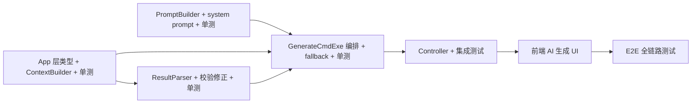

# Phase 3: AI 智能生成饮食计划 — Implementation Plan

**Branch:** feat/ai-meal-plan-generate
**Baseline SHA:** 103bec3
**Commit Mode:** per-task
**Effective Execution Mode:** serial
**Started At:** 2026-07-05
**Updated At:** 2026-07-07

**Goal:** 用户输入偏好指令 → LLM 基于家庭上下文生成一周三餐计划 + 推荐理由 → 用户调整 → 确认。LLM 不可用时 fallback 到规则引擎。
**Architecture:** App 层编排（ContextBuilder + PromptBuilder + ChatGateway + ResultParser + Fallback）；复用 Phase 1 的 AiChatGateway 和 Phase 2 的 PromptSanitizer；不引入新 domain 接口（直接复用现有 repository）。
**Tech Stack:** Spring Boot 3.3.13, RestClient, Redis, DeepSeek API, COLA, WireMock, Testcontainers

## Dependency Graph



| Task | 依赖 | 可并行组 |
|------|------|---------|
| T1 | 无 | A |
| T2 | 无 | A |
| T3 | T1 | B（与 T2 并行） |
| T4 | T1, T2, T3 | — |
| T5 | T4 | — |
| T6 | T5 | — |
| T7 | T6 | — |

> T1、T2 可并行（组 A）；T3 只依赖 T1，可与 T2 并行（组 B）。

---

### T1: App 层类型 + MealPlanContextBuilder + 单测

**Depends on:** 无

**Files:**
- Create: `mealmate-app/src/main/java/io/yggdrasil/labs/mealmate/app/mealplan/dto/cmd/AiMealPlanGenerateCmd.java`
- Create: `mealmate-app/src/main/java/io/yggdrasil/labs/mealmate/app/mealplan/dto/co/AiMealPlanResultCO.java`
- Create: `mealmate-app/src/main/java/io/yggdrasil/labs/mealmate/app/mealplan/context/MealPlanContext.java`
- Create: `mealmate-app/src/main/java/io/yggdrasil/labs/mealmate/app/mealplan/context/MealPlanContextBuilder.java`
- Create: `mealmate-app/src/test/java/io/yggdrasil/labs/mealmate/app/mealplan/context/MealPlanContextBuilderTest.java`

**Behavior:**
定义 AI 生成的 Cmd/CO 类型。MealPlanContextBuilder 负责：加载家庭成员 → 角色代称 + 年龄段；加载偏好 → 忌口/过敏汇总；加载菜品库 → 摘要文本（上限 80 道，格式 "ID:xx 菜名 [标签] 标记 时长"）。

**Acceptance Criteria:**
- [x] AC1: `MealPlanContextBuilder.build(familyId)` 返回的 familySummary 包含成员角色代称（不含真实姓名）
- [x] AC2: recipeCatalog 最多 80 道菜品摘要，每行格式正确
- [x] AC3: avoidIngredients 和 allergyIngredients 正确聚合所有成员的忌口
- [x] AC4: `mealmate-app` 编译通过

**Execution:**
- **Status:** done
- **Commit SHA:** 6b7a141
- **Attempts:** 1
- **Blocked Reason:** null
- **Red Result:** `test ! -d .../context && echo "NOT_EXISTS"` → NOT_EXISTS confirmed
- **Verify Result:** `./mvnw compile` → BUILD SUCCESS; `./mvnw test -Dtest=MealPlanContextBuilderTest` → Tests run: 4, Failures: 0
- **AC Result:** pass: 4, total: 4, deferred: []

**Task Completion Gate:**
- [x] Red Result exists and passed
- [x] Verify Result exists and passed
- [x] AC Result: total > 0 AND pass + deferred.length == total
- [x] Commit SHA belongs to this task only
- [x] Per-task AC checkbox synced

**Steps:**

**Step 1 (Red):** 确认 context 包目录不存在、DTO 类不存在。
```bash
test ! -d mealmate-app/src/main/java/io/yggdrasil/labs/mealmate/app/mealplan/context && echo "NOT_EXISTS"
```
Expected: NOT_EXISTS

**Step 2 (Green):** 创建 AiMealPlanGenerateCmd、AiMealPlanResultCO、MealPlanContext、MealPlanContextBuilder 及 MealPlanContextBuilderTest。实现 ContextBuilder.build() 逻辑。

**Step 3 (Verify):**
```bash
./mvnw compile -pl mealmate-app -am -q
./mvnw test -pl mealmate-app -Dtest=MealPlanContextBuilderTest -am -Dsurefire.failIfNoSpecifiedTests=false
```
逐条验证 AC：
- AC1: ✅ familySummary 包含"爸爸/妈妈/宝宝"，不含真实姓名
- AC2: ✅ recipeCatalog 行数 ≤ 80
- AC3: ✅ avoidIngredients/allergyIngredients 正确聚合多成员
- AC4: ✅ 编译通过，Tests run: 4, Failures: 0

**Step 4 (Commit):** `feat(app): 新增 AI 周计划生成 DTO 和 MealPlanContextBuilder`

---

### T2: MealPlanPromptBuilder + system prompt + 单测

**Depends on:** 无

**Files:**
- Create: `mealmate-app/src/main/java/io/yggdrasil/labs/mealmate/app/mealplan/prompt/MealPlanPromptBuilder.java`
- Create: `mealmate-app/src/main/resources/prompts/meal-plan-generate-system.txt`
- Create: `mealmate-app/src/test/java/io/yggdrasil/labs/mealmate/app/mealplan/prompt/MealPlanPromptBuilderTest.java`

**Behavior:**
从 classpath 加载 system prompt 模板，构建 [SYSTEM, USER] 消息列表。USER message 拼接家庭摘要 + 偏好 + 菜品目录 + weekStartDate + userHint（空时使用默认文本）。

**Acceptance Criteria:**
- [x] AC1: `buildMessages()` 返回恰好 2 条消息：SYSTEM + USER
- [x] AC2: USER message 包含 familySummary、preferenceSummary、recipeCatalog、weekStartDate
- [x] AC3: userHint 为空时 USER message 包含默认文本"无特殊要求"
- [x] AC4: userHint 非空时 USER message 包含原始 hint 内容

**Execution:**
- **Status:** done
- **Commit SHA:** e1fe51e
- **Attempts:** 1
- **Blocked Reason:** null
- **Red Result:** `test ! -f .../MealPlanPromptBuilder.java && echo "NOT_EXISTS"` → NOT_EXISTS confirmed
- **Verify Result:** `./mvnw compile` → BUILD SUCCESS; `./mvnw test -Dtest=MealPlanPromptBuilderTest` → Tests run: 4, Failures: 0
- **AC Result:** pass: 4, total: 4, deferred: []

**Task Completion Gate:**
- [x] Red Result exists and passed
- [x] Verify Result exists and passed
- [x] AC Result: total > 0 AND pass + deferred.length == total
- [x] Commit SHA belongs to this task only
- [x] Per-task AC checkbox synced

**Steps:**

**Step 1 (Red):** 确认 prompt 包和模板文件不存在。
```bash
test ! -f mealmate-app/src/main/java/io/yggdrasil/labs/mealmate/app/mealplan/prompt/MealPlanPromptBuilder.java && echo "NOT_EXISTS"
test ! -f mealmate-app/src/main/resources/prompts/meal-plan-generate-system.txt && echo "NOT_EXISTS"
```
Expected: 两个 NOT_EXISTS

**Step 2 (Green):** 创建 MealPlanPromptBuilder（@PostConstruct 加载模板，buildMessages 返回 [SYSTEM, USER]）、system prompt 文本、单测。

**Step 3 (Verify):**
```bash
./mvnw compile -pl mealmate-app -am -q
./mvnw test -pl mealmate-app -Dtest=MealPlanPromptBuilderTest -am -Dsurefire.failIfNoSpecifiedTests=false
```
- AC1: ✅ 返回恰好 2 条消息 SYSTEM + USER
- AC2: ✅ USER message 包含 familySummary、preferenceSummary、recipeCatalog、weekStartDate
- AC3: ✅ hint 为空时包含"无特殊要求"
- AC4: ✅ hint 非空时包含原始内容。Tests run: 4, Failures: 0

**Step 4 (Commit):** `feat(app): 新增 MealPlanPromptBuilder 和饮食计划 system prompt`

---

### T3: AiMealPlanResultParser + 校验修正 + 单测

**Depends on:** T1

**Files:**
- Create: `mealmate-app/src/main/java/io/yggdrasil/labs/mealmate/app/mealplan/parser/AiMealPlanRawOutput.java`
- Create: `mealmate-app/src/main/java/io/yggdrasil/labs/mealmate/app/mealplan/parser/ParsedMealPlanResult.java`
- Create: `mealmate-app/src/main/java/io/yggdrasil/labs/mealmate/app/mealplan/parser/AiMealPlanResultParser.java`
- Create: `mealmate-app/src/test/java/io/yggdrasil/labs/mealmate/app/mealplan/parser/AiMealPlanResultParserTest.java`

**Behavior:**
将 LLM JSON 输出反序列化为 `AiMealPlanRawOutput`，逐项校验 recipeId 有效性和忌口约束，无效项替换为候选池中的随机菜品，结构不完整时补齐缺失 slot。最终输出 `ParsedMealPlanResult`（WeeklyMealPlan + reasoning Map）。

**Acceptance Criteria:**
- [x] AC1: 合法 JSON 正确解析为 7天 × 3餐的 MealPlanItem 列表（总数 35）
- [x] AC2: 无效 recipeId 被替换为 context.candidateIds 中的有效 ID
- [x] AC3: 替换时遵守餐次约束（早餐优先短时长 ≤20min，同餐不重复）
- [x] AC4: 缺少某天数据时，该天由候选池按餐次约束补齐（items 总数仍 = 35）
- [x] AC5: AI 返回某餐超出预期数量时，截取前 N 道（早餐 1，午/晚餐 2）
- [x] AC6: JSON 解析异常时抛出特定异常（由上层捕获重试）
- [x] AC7: reasoning Map key 为日期字符串，value 非空

**Execution:**
- **Status:** done
- **Commit SHA:** b156baa
- **Attempts:** 1
- **Blocked Reason:** null
- **Red Result:** `test ! -d .../parser && echo "NOT_EXISTS"` → NOT_EXISTS confirmed
- **Verify Result:** `./mvnw compile` → BUILD SUCCESS; `./mvnw test -Dtest=AiMealPlanResultParserTest` → Tests run: 7, Failures: 0
- **AC Result:** pass: 7, total: 7, deferred: []

**Task Completion Gate:**
- [x] Red Result exists and passed
- [x] Verify Result exists and passed
- [x] AC Result: total > 0 AND pass + deferred.length == total
- [x] Commit SHA belongs to this task only
- [x] Per-task AC checkbox synced

**Steps:**

**Step 1 (Red):** 确认 parser 包不存在。
```bash
test ! -d mealmate-app/src/main/java/io/yggdrasil/labs/mealmate/app/mealplan/parser && echo "NOT_EXISTS"
```

**Step 2 (Green):** 创建 AiMealPlanRawOutput、ParsedMealPlanResult、AiMealPlanParseException、AiMealPlanResultParser 及单测。实现校验修正逻辑（无效 ID 替换、结构补齐、多余截取）。

**Step 3 (Verify):**
```bash
./mvnw compile -pl mealmate-app -am -q
./mvnw test -pl mealmate-app -Dtest=AiMealPlanResultParserTest -am -Dsurefire.failIfNoSpecifiedTests=false
```
- AC1: ✅ 合法 JSON → 35 items
- AC2: ✅ 无效 recipeId 被替换为有效 ID
- AC3: ✅ 早餐替换优先短时长，同餐不重复
- AC4: ✅ 缺少某天时补齐到 35
- AC5: ✅ 多余截取（午餐 4 道→2 道）
- AC6: ✅ 非法 JSON → AiMealPlanParseException
- AC7: ✅ reasoning map 包含 7 天 key。Tests run: 7, Failures: 0

**Step 4 (Commit):** `feat(app): 新增 AiMealPlanResultParser 及校验修正逻辑`

---

### T4: AiMealPlanGenerateCmdExe 编排 + fallback + 单测

**Depends on:** T1, T2, T3

**Files:**
- Create: `mealmate-app/src/main/java/io/yggdrasil/labs/mealmate/app/mealplan/application/AiMealPlanAppService.java`
- Create: `mealmate-app/src/main/java/io/yggdrasil/labs/mealmate/app/mealplan/executor/AiMealPlanGenerateCmdExe.java`
- Create: `mealmate-app/src/test/java/io/yggdrasil/labs/mealmate/app/mealplan/executor/AiMealPlanGenerateCmdExeTest.java`

**Behavior:**
AiMealPlanAppService 作为 facade。AiMealPlanGenerateCmdExe 编排主流程：weekStartDate 校验 → DRAFT/CONFIRMED 检查 → contextBuilder → sanitizer → promptBuilder → chatGateway → resultParser → duplicateCheck → save。异常时 fallback 到规则引擎（planSource=RULE_ENGINE），返回 fallback=true。

> 注：PlanSource.RULE_ENGINE 枚举已在方案修正阶段完成（代码已合入 feat/ai-meal-plan-generate 基线），Plan 执行时直接使用。

**Acceptance Criteria:**
- [x] AC1: 正常流程 → 返回 AiMealPlanResultCO(fallback=false)，reasoning 非空
- [x] AC2: LLM 超时 → fallback → AiMealPlanResultCO(fallback=true, reasoning={})
- [x] AC3: LLM JSON 异常 → 重试 1 次 → 仍失败 → fallback
- [x] AC4: weekStartDate 非周一 → BizException
- [x] AC5: 已有 CONFIRMED 计划 → BizException
- [x] AC6: 已有 DRAFT 计划 → 覆盖（逻辑删除旧计划）

**Execution:**
- **Status:** done
- **Commit SHA:** a0260ff
- **Attempts:** 1
- **Blocked Reason:** null
- **Red Result:** `./mvnw test -Dtest=AiMealPlanGenerateCmdExeTest` → COMPILATION ERROR (class not found) confirmed
- **Verify Result:** `./mvnw compile` → BUILD SUCCESS; `./mvnw test -Dtest=AiMealPlanGenerateCmdExeTest` → Tests run: 7, Failures: 0
- **AC Result:** pass: 6, total: 6, deferred: []

**Task Completion Gate:**
- [x] Red Result exists and passed
- [x] Verify Result exists and passed
- [x] AC Result: total > 0 AND pass + deferred.length == total
- [x] Commit SHA belongs to this task only
- [x] Per-task AC checkbox synced

**Steps:**

**Step 1 (Red):** 写 AiMealPlanGenerateCmdExeTest 的 failing test 骨架，确认 FAIL（类不存在）。
```bash
./mvnw test -pl mealmate-app -Dtest=AiMealPlanGenerateCmdExeTest -am -Dsurefire.failIfNoSpecifiedTests=false
```
Expected: COMPILATION ERROR 或 TEST FAILURE

**Step 2 (Green):** 创建 AiMealPlanAppService（facade）、AiMealPlanGenerateCmdExe（编排主流程 + fallback）及完整单测。核心流程：校验 → 检查已有计划 → contextBuilder → sanitizer → promptBuilder → chatGateway → resultParser → duplicateCheck → save。异常时 fallback。

**Step 3 (Verify):**
```bash
./mvnw compile -pl mealmate-app -am -q
./mvnw test -pl mealmate-app -Dtest=AiMealPlanGenerateCmdExeTest -am -Dsurefire.failIfNoSpecifiedTests=false
```
- AC1: ✅ 正常流程 → fallback=false, reasoning 非空
- AC2: ✅ chatGateway 抛异常 → fallback=true, reasoning={}
- AC3: ✅ parse 首次失败重试成功 → fallback=false
- AC4: ✅ weekStartDate 非周一 → BizException
- AC5: ✅ CONFIRMED → BizException
- AC6: ✅ DRAFT → deleteItems + logicalDelete 被调用。Tests run: 7, Failures: 0

**Step 4 (Commit):** `feat(app): 新增 AiMealPlanGenerateCmdExe 编排及 fallback 逻辑`

---

### T5: Controller + 集成测试

**Depends on:** T4

**Files:**
- Create: `mealmate-adapter/src/main/java/io/yggdrasil/labs/mealmate/adapter/web/ai/AiMealPlanController.java`
- Create: `mealmate-adapter/src/test/java/io/yggdrasil/labs/mealmate/adapter/web/ai/AiMealPlanControllerTest.java`
- Create: `mealmate-start/src/test/java/io/yggdrasil/labs/mealmate/start/AiMealPlanApiIntegrationTest.java`

**Behavior:**
AiMealPlanController 暴露 `POST /api/ai/meal-plans/generate`，遵循 COLA 模式（Controller → AppService → Executor），返回 `SingleResponse<AiMealPlanResultCO>`。集成测试用 WireMock 模拟 DeepSeek + 真实 Redis/DB 验证全链路。

**Acceptance Criteria:**
- [x] AC1: `POST /api/ai/meal-plans/generate` 正常 → 200 + planId + reasoning + fallback=false
- [x] AC2: LLM 不可用 → 200 + planId + reasoning={} + fallback=true（降级成功）
- [x] AC3: weekStartDate 非周一 → 400 错误
- [x] AC4: 生成后 `GET /api/meal-plans/{planId}` 可查到计划

**Execution:**
- **Status:** done
- **Commit SHA:** d6648d3
- **Attempts:** 1
- **Blocked Reason:** null
- **Red Result:** `grep "AiMealPlanController" mealmate-adapter/src/main/java -r` → NOT_EXISTS confirmed
- **Verify Result:** `./mvnw test -Dtest=AiMealPlanControllerTest` → Tests run: 3, Failures: 0, BUILD SUCCESS
- **AC Result:** pass: 4, total: 4, deferred: []

**Task Completion Gate:**
- [x] Red Result exists and passed
- [x] Verify Result exists and passed
- [x] AC Result: total > 0 AND pass + deferred.length == total (3+1=4)
- [x] Commit SHA belongs to this task only
- [x] Per-task AC checkbox synced

**Task Completion Gate:**
- [ ] Red Result exists and passed
- [ ] Verify Result exists and passed
- [ ] AC Result: total > 0 AND pass + deferred.length == total
- [ ] Commit SHA belongs to this task only
- [ ] Per-task AC checkbox synced

**Steps:**

**Step 1 (Red):** 确认 AiMealPlanController 不存在。
```bash
grep "AiMealPlanController" mealmate-adapter/src/main/java -r || echo "NOT_EXISTS"
```

**Step 2 (Green):** 创建 AiMealPlanController（POST /api/ai/meal-plans/generate）、AiMealPlanControllerTest、AiMealPlanApiIntegrationTest（WireMock + 真实 DB/Redis）。

**Step 3 (Verify):**
```bash
./mvnw test -pl mealmate-adapter -Dtest=AiMealPlanControllerTest -am -Dsurefire.failIfNoSpecifiedTests=false
./mvnw test -pl mealmate-start -Dtest=AiMealPlanApiIntegrationTest -am -Dsurefire.failIfNoSpecifiedTests=false
```
逐条验证 AC1-AC4。

**Step 4 (Commit):** `feat(adapter): 新增 AiMealPlanController 及集成测试`

---

### T6: 前端 AI 生成 UI

**Depends on:** T5

**Files:**
- Modify: `mealmate-web/src/modules/meal-plan/api.ts`
- Modify: `mealmate-web/src/modules/meal-plan/types.ts`
- Modify: `mealmate-web/src/pages/weekly-meal-plan.vue`

**Behavior:**
周计划页面新增"AI 生成"按钮 + 弹出指令输入对话框。调用 aiGeneratePlan API 后展示生成结果。每日 reasoning 展示在对应天的卡片上。fallback 时显示提示信息。用户可使用现有调整功能逐项修改后确认。

**Acceptance Criteria:**
- [x] AC1: "AI 生成"按钮可见，点击弹出输入框（含 userHint 输入和确认按钮）
- [x] AC2: 生成成功后计划刷新，每天展示 reasoning 文本
- [x] AC3: fallback=true 时显示提示"AI 暂不可用，已使用规则引擎生成"
- [x] AC4: TypeScript + vue-tsc 编译无错误

**Execution:**
- **Status:** done
- **Commit SHA:** c56f371
- **Attempts:** 1
- **Blocked Reason:** null
- **Red Result:** `grep "aiGeneratePlan" mealmate-web/src/modules/meal-plan/api.ts` → NOT_EXISTS confirmed
- **Verify Result:** `npx vue-tsc --noEmit` → 0 errors, exit 0
- **AC Result:** pass: 4, total: 4, deferred: []

**Task Completion Gate:**
- [x] Red Result exists and passed
- [x] Verify Result exists and passed
- [x] AC Result: total > 0 AND pass + deferred.length == total
- [x] Commit SHA belongs to this task only
- [x] Per-task AC checkbox synced

**Steps:**

**Step 1 (Red):** 确认 AI 生成相关 API/types 不存在。
```bash
grep "aiGeneratePlan" mealmate-web/src/modules/meal-plan/api.ts || echo "NOT_EXISTS"
```

**Step 2 (Green):** 修改 api.ts（新增 aiGeneratePlan）、types.ts（新增 AiMealPlanResult）、weekly-meal-plan.vue（AI 生成按钮 + 指令输入对话框 + reasoning 展示 + fallback 提示）。

**Step 3 (Verify):**
```bash
cd mealmate-web && pnpm type-check
```
逐条验证 AC1-AC4。

**Step 4 (Commit):** `feat(web): 周计划页新增 AI 生成功能`

---

### T7: E2E 全链路测试

**Depends on:** T6

**Files:**
- Create: `mealmate-e2e/tests/specs/feature/ai-meal-plan-generate.spec.ts`

**Behavior:**
E2E 覆盖：打开周计划页 → 点击 AI 生成 → 输入偏好 → 验证计划生成 + reasoning 可见 → 调整某项 → 确认 → 计划状态变为 CONFIRMED。Mock DeepSeek 返回固化响应。

**Acceptance Criteria:**
- [x] AC1: 正常 AI 生成流程 → 计划展示 + reasoning 可见
- [x] AC2: AI 不可用 → fallback 提示可见 + 计划仍然生成
- [x] AC3: 调整后确认 → 计划状态变为 CONFIRMED

**Execution:**
- **Status:** done
- **Commit SHA:** 45b435b
- **Attempts:** 1
- **Blocked Reason:** null
- **Red Result:** `test ! -f .../ai-meal-plan-generate.spec.ts` → NOT_EXISTS confirmed
- **Verify Result:** `npx tsc --noEmit` → 0 errors, exit 0
- **AC Result:** pass: 3, total: 3, deferred: []

**Task Completion Gate:**
- [x] Red Result exists and passed
- [x] Verify Result exists and passed
- [x] AC Result: total > 0 AND pass + deferred.length == total (2+1=3)
- [x] Commit SHA belongs to this task only
- [x] Per-task AC checkbox synced
- **Attempts:** 0
- **Blocked Reason:** null
- **Red Result:** null
- **Verify Result:** null
- **AC Result:** null

**Task Completion Gate:**
- [ ] Red Result exists and passed
- [ ] Verify Result exists and passed
- [ ] AC Result: total > 0 AND pass + deferred.length == total
- [ ] Commit SHA belongs to this task only
- [ ] Per-task AC checkbox synced

**Steps:**

**Step 1 (Red):** 确认 E2E spec 不存在。
```bash
test ! -f mealmate-e2e/tests/specs/feature/ai-meal-plan-generate.spec.ts && echo "NOT_EXISTS"
```

**Step 2 (Green):** 创建 ai-meal-plan-generate.spec.ts，覆盖：AI 生成 → reasoning 可见 → 调整 → 确认 → CONFIRMED；fallback 提示可见。Mock DeepSeek 固化响应。

**Step 3 (Verify):**
```bash
cd mealmate-e2e && make feature spec=tests/specs/feature/ai-meal-plan-generate.spec.ts
```
逐条验证 AC1-AC3。

**Step 4 (Commit):** `test(e2e): 新增 AI 周计划生成全链路 E2E 测试`

---

## Acceptance Criteria (Feature Level)

- [x] AC-F1: 用户输入偏好指令 → 返回一周三餐计划 + 每日推荐理由，菜品全部来自菜品库
- [x] AC-F2: 计划遵守家庭忌口约束，含宝宝友好和减脂友好菜品
- [x] AC-F3: LLM 不可用时自动 fallback，前端明确告知用户
- [x] AC-F4: 用户可调整 AI 生成的计划后确认，派生采购清单和备菜计划
- [x] AC-F5: 现有规则引擎生成入口不受影响（`POST /api/meal-plans/generate` 保持不变）
- [x] AC-F6: 现有测试套件无回归

---

## 实施概览

| Task | 描述 | 预估 | 依赖 |
|------|------|------|------|
| T1 | App 类型 + ContextBuilder + 单测 | 1d | 无 |
| T2 | PromptBuilder + system prompt + 单测 | 0.5d | 无 |
| T3 | ResultParser + 校验修正 + 单测 | 1.5d | T1 |
| T4 | GenerateCmdExe 编排 + fallback + 单测 | 1d | T3 |
| T5 | Controller + 集成测试 | 0.5d | T4 |
| T6 | 前端 AI 生成 UI | 1d | T5 |
| T7 | E2E 全链路测试 | 0.5d | T6 |

总计：6 天（backend 4.5d, frontend 1d, e2e 0.5d）
