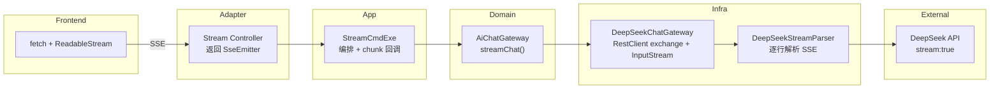

# Phase 4.1: AI 流式输出（SSE）— 设计文档

**Status:** design
**Created:** 2026-07-10
**Updated:** 2026-07-10
**Owner:** yangyang
**Resolved Path:** docs/active/llm-integration/
**Spec:** [phase4-sse-spec.md](phase4-sse-spec.md) — 5 Behaviors, 15 Scenarios

## 1. Context

Phase 1-3 已交付两项 AI 能力（菜品解析 + 周计划生成），均为同步阻塞模式：前端 POST → 后端调用 DeepSeek API（3-8s）→ 返回完整 JSON。用户在等待期间无任何反馈，体验差。

DeepSeek API 兼容 OpenAI 协议，原生支持 `stream: true` 返回 SSE 格式的 chunked response。后端可逐 chunk 转发给前端，实现打字机效果，首字节延迟从 3-8s 降至 ~500ms。

## 2. Goal

为 AI 菜品解析和周计划生成增加 SSE 流式端点。TTFB P95 ≤ 500ms。不改变业务逻辑。

## 3. Non-Goal

- 不引入 Spring WebFlux 依赖（使用 WebMVC 的 SseEmitter）
- 不改变现有业务逻辑（状态机、merge、fallback 行为保留）
- 不实现 WebSocket
- 不改变 confirm 等非 AI 直接调用的接口
- 不删除现有同步端点（向后兼容）

## 4. Architecture



数据流：DeepSeek 返回 `data: {"choices":[{"delta":{"content":"你"}}]}` → Parser 提取 "你" → Gateway 回调 onChunk → Executor 转发 → Controller 通过 SseEmitter.send → 前端 EventSource 接收显示。

## 5. Interface Contract

### 5.1 Domain 层 — AiChatGateway 新增方法

```java
public interface AiChatGateway {
    // 现有同步方法保留
    AiChatResult chat(AiChatRequest request);

    // 新增流式方法
    void streamChat(AiChatRequest request,
                    AtomicBoolean cancelled,
                    Consumer<String> onChunk,
                    Consumer<AiChatResult> onComplete,
                    Consumer<Exception> onError);
}
```

- `cancelled`: 外部传入的取消标志，为 true 时应尽快停止读取并关闭连接
- `onChunk`: 每收到一个文本片段回调一次（在流式读取线程中同步调用）
- `onComplete`: 流式结束时回调，携带累积的完整结果（content + token 统计）
- `onError`: 异常时回调（网络中断、DeepSeek 返回错误等）

> Domain 层使用 `java.util.concurrent.atomic.AtomicBoolean` 和 `java.util.function.Consumer`，均为 JDK 标准库类型，不引入外部依赖。回调模式（推式）适合流式场景——Gateway 实现决定何时调用回调，domain 层不对线程模型做假设。

### 5.2 Infrastructure 层 — DeepSeek 流式实现

**ChatCompletionRequest 新增字段：**
```java
private Boolean stream;  // true 时启用流式
```

**新增 ChatCompletionChunk DTO：**
```java
@Data
public class ChatCompletionChunk {
    private String id;
    private List<Choice> choices;
    private Usage usage; // 仅最后一个 chunk 携带

    @Data
    public static class Choice {
        private int index;
        private Delta delta;
        private String finishReason;
    }

    @Data
    public static class Delta {
        private String content;
        private String reasoningContent;
    }
}
```

**新增 DeepSeekStreamParser：**
```java
@Component
public class DeepSeekStreamParser {
    /**
     * 从 InputStream 逐行读取 SSE 格式数据。
     * 每解析到一个有效 chunk 调用 onChunk。
     * 遇到 data: [DONE] 时结束。
     *
     * @param cancelled 每次循环检查，为 true 时提前退出并关闭 InputStream
     * @throws IOException 网络中断时由调用方（streamChat）捕获并传递到 onError
     */
    public void parse(InputStream inputStream,
                      AtomicBoolean cancelled,
                      Consumer<ChatCompletionChunk> onChunk,
                      Runnable onDone) throws IOException {
        // 使用 try-with-resources 确保 InputStream 关闭
        // BufferedReader 逐行读取
        // 每次 readLine 前检查 cancelled.get()
        // 解析 "data: " 前缀行，忽略 "event:" 和空行
        // data: [DONE] → onDone + break
        // 其他 data 行 → Jackson 反序列化为 ChatCompletionChunk → onChunk
        // IOException → 向上抛出，由 streamChat 捕获传递到 onError
    }
}
```

**DeepSeekChatGateway.streamChat 实现要点：**
- 使用流式专用 `deepSeekStreamRestClient`（JdkClientHttpRequestFactory）
- 通过 `RestClient.post().exchange()` 获取 ClientHttpResponse
- 使用 try-with-resources 确保 ClientHttpResponse 和 InputStream 关闭
- 委托 DeepSeekStreamParser.parse(inputStream, cancelled, onChunk, onDone)
- Parser 中每次循环检查 `cancelled.get()`，为 true 时 break 并关闭 stream
- 累积所有 delta.content 拼接为完整 content
- 最后一个 chunk（finish_reason=stop/length）中提取 usage
- 构建 AiChatResult 回调 onComplete
- 任何异常（IOException、解析异常）在 catch 中回调 onError

**DeepSeekConfig 新增流式 RestClient Bean：**
```java
@Bean
public RestClient deepSeekStreamRestClient(DeepSeekProperties properties) {
    // 使用 JdkClientHttpRequestFactory（基于 Java 11+ HttpClient）
    // 支持真正的流式读取（chunked transfer），不会 buffer 整个响应体
    JdkClientHttpRequestFactory factory = new JdkClientHttpRequestFactory();
    factory.setReadTimeout(Duration.ofSeconds(30));

    return RestClient.builder()
            .baseUrl(properties.getBaseUrl())
            .defaultHeader("Authorization", "Bearer " + properties.getApiKey())
            .defaultHeader("Content-Type", "application/json")
            .requestFactory(factory)
            .build();
}
```

> 注：现有同步 RestClient 继续使用 SimpleClientHttpRequestFactory（适合短连接）。流式 RestClient 单独定义是因为 SimpleClientHttpRequestFactory 基于 HttpURLConnection，会 buffer 整个响应体，无法逐行读取 chunked SSE 数据。

**新增流式线程池配置：**
```java
@Configuration
public class AiStreamAsyncConfig {
    @Bean("aiStreamExecutor")
    public TaskExecutor aiStreamExecutor() {
        ThreadPoolTaskExecutor executor = new ThreadPoolTaskExecutor();
        executor.setCorePoolSize(4);
        executor.setMaxPoolSize(8);
        executor.setQueueCapacity(32);
        executor.setThreadNamePrefix("ai-stream-");
        executor.setRejectedExecutionHandler(new ThreadPoolExecutor.CallerRunsPolicy());
        executor.initialize();
        return executor;
    }
}
```

> 参数说明：core=4 覆盖常规并发（AI 调用非高频）；max=8 应对突发；queue=32 缓冲等待；CallerRunsPolicy 确保不丢弃请求。Controller 中通过 `@Qualifier("aiStreamExecutor")` 注入。

### 5.3 Adapter 层 — 流式 Controller

**POST /api/ai/recipes/chat/stream** → SseEmitter

```java
@PostMapping(value = "/chat/stream", produces = MediaType.TEXT_EVENT_STREAM_VALUE)
public SseEmitter chatStream(@RequestBody @Valid AiRecipeParseChatCmd cmd) {
    SseEmitter emitter = new SseEmitter(60_000L); // 60s，大于 DeepSeek 最大响应时长
    AtomicBoolean cancelled = new AtomicBoolean(false);

    // 客户端断开或超时时设置取消标志，触发 InputStream 关闭
    emitter.onCompletion(() -> cancelled.set(true));
    emitter.onTimeout(() -> cancelled.set(true));
    emitter.onError(e -> cancelled.set(true));

    aiStreamExecutor.execute(() -> {
        try {
            aiRecipeAppService.chatStream(cmd, cancelled,
                chunk -> emitter.send(event().name("chunk").data(chunk)),
                result -> {
                    emitter.send(event().name("done").data("[DONE]"));
                    emitter.send(event().name("result").data(result));
                    emitter.complete();
                },
                error -> {
                    emitter.send(event().name("error").data(errorJson(error)));
                    emitter.complete();
                });
        } catch (Exception e) {
            emitter.completeWithError(e);
        }
    });
    return emitter;
}
```

> **线程模型说明**：onChunk 回调在 aiStreamExecutor 线程池的同一线程中同步执行（DeepSeekStreamParser 逐行读取 → 解析 → 回调 → emitter.send）。不存在多线程并发 send 的问题。cancelled 标志由 Servlet 容器线程设置，Parser 线程读取——AtomicBoolean 保证可见性。

**POST /api/ai/meal-plans/generate/stream** → SseEmitter（结构同上）

fallback 场景：streamChat 的 onError 触发时，发送 error event 通知前端，然后调用规则引擎，发送 result event。

### 5.4 App 层 — Stream Executor

**AiRecipeParseStreamCmdExe：**
```java
public void execute(AiRecipeParseChatCmd cmd,
                    Consumer<String> onChunk,
                    Consumer<AiRecipeParseResultCO> onResult,
                    Consumer<Exception> onError) {
    // 1. loadSession + loadCache（与同步版相同）
    // 2. sanitize(cmd.message)
    // 3. buildMessages(session, cache, sanitizedInput)
    // 4. chatGateway.streamChat(request, onChunk, onComplete, onStreamError)
    //    onComplete: parseJson → merge → determineStatus → persist → onResult
    //    onStreamError: onError
}
```

**AiMealPlanGenerateStreamCmdExe：**
```java
public void execute(AiMealPlanGenerateCmd cmd,
                    Consumer<String> onChunk,
                    Consumer<AiMealPlanResultCO> onResult,
                    Consumer<Exception> onError) {
    // 1. validate + checkExisting（与同步版相同）
    // 2. contextBuilder.build(familyId)
    // 3. sanitize + promptBuilder
    // 4. chatGateway.streamChat(request, onChunk, onComplete, onStreamError)
    //    onComplete: resultParser.parse → persist → onResult(fallback=false)
    //    onStreamError: fallback to rule engine → onResult(fallback=true)
}
```

### 5.5 前端 — useAiStream composable

使用 `fetch` + `ReadableStream` + `eventsource-parser` 库（轻量 SSE 行解析器，~2KB，处理跨 chunk 边界的不完整行拼接）。

```typescript
import { createParser } from 'eventsource-parser'

export function useAiStream() {
  const chunks = ref('')
  const loading = ref(false)
  const error = ref<string | null>(null)
  let abortController: AbortController | null = null

  async function stream(url: string, body: object, options: {
    onChunk: (text: string) => void
    onResult: (data: any) => void
    onError?: (err: { code: string; message: string }) => void
  }): Promise<void> {
    abortController = new AbortController()
    // 1. fetch(url, { method: 'POST', body, signal: abortController.signal, headers })
    // 2. reader = response.body.getReader()
    // 3. 用 eventsource-parser 的 createParser 处理 SSE 行解析
    //    （自动处理跨 chunk 边界、多行 data、空行分隔等边界情况）
    // 4. parser.feed(chunk) → 触发事件回调：
    //    event.type === 'chunk' → options.onChunk(event.data)
    //    event.type === 'done'  → 标记流结束
    //    event.type === 'result' → options.onResult(JSON.parse(event.data))
    //    event.type === 'error' → options.onError(JSON.parse(event.data))
  }

  function abort() {
    abortController?.abort()
    abortController = null
  }

  return { chunks, loading, error, stream, abort }
}
```

> 选择 `eventsource-parser` 而非手写解析器：SSE 格式看似简单，但跨 chunk 边界的行拼接、多行 data field、注释行过滤等容易引入 bug。该库是 Vercel AI SDK 使用的同一解析器，体积小、无依赖。

修改 `useAiChat.send()` 和 `aiGeneratePlan()`：调用流式端点，逐步更新 messages。

## 6. SSE 事件协议

| 事件类型 | data 格式 | 含义 |
|----------|-----------|------|
| chunk | 纯文本片段（UTF-8） | AI 输出的增量文字 |
| done | `[DONE]` | 流式输出结束标记 |
| result | JSON 对象 | 完整业务结果（结构与同步端点响应体一致） |
| error | `{"code":"...","message":"..."}` | 错误信息 |

SSE 输出示例：
```
event: chunk
data: 我帮你

event: chunk
data: 整理了菜品

event: done
data: [DONE]

event: result
data: {"sessionId":"uuid","status":"REFINING","parsed":{...},"reply":"我帮你整理了菜品...","suggestions":["补充步骤"]}

```

## 7. Error Handling

| 错误场景 | 后端行为 | 前端处理 |
|----------|----------|----------|
| DeepSeek 建连前超时 | 发送 error event + complete | 显示错误提示 |
| DeepSeek 流式中途断开 | Parser 捕获 IOException → onError → error event → fallback（周计划） | 菜品：错误提示；计划：fallback 提示 |
| JSON 解析失败 | 菜品：result(parsed=null)；计划：fallback | 按场景展示 |
| finish_reason=length（截断） | 菜品：正常返回 REFINING；计划：视为异常重试 → fallback | 菜品：提示补充；计划：fallback 提示 |
| SseEmitter 60s 超时 | completeWithError + cancelled=true → Parser break → InputStream 关闭 | 前端 fetch 感知连接关闭，提示重试 |
| 客户端主动 abort | emitter.onCompletion → cancelled=true → Parser 下次循环 break → InputStream 关闭 | 无需处理 |
| 同一 sessionId 并发 | 后端检测到 session 正在处理 → error event(AI_SESSION_BUSY) | 提示等待 |

**资源关闭路径（前端 abort 场景）：**
1. 前端 `abortController.abort()` → fetch 连接断开
2. Servlet 容器检测到客户端断开 → 触发 `emitter.onCompletion()`
3. onCompletion 回调中 `cancelled.set(true)`
4. DeepSeekStreamParser 下一次 `readLine()` 前检查 `cancelled.get()` → break
5. try-with-resources 关闭 InputStream → 底层 HTTP 连接释放

**Back-pressure 说明：**
由于 onChunk 和 emitter.send 在同一线程同步执行（读取 → 解析 → send → 继续读取），天然形成 back-pressure：如果客户端消费慢导致 TCP send buffer 满，emitter.send 会阻塞，Parser 暂停读取 DeepSeek，无缓冲区膨胀风险。

## 8. Security

- 复用 Phase 2/3 的安全措施（sanitize、角色代称、recipeId 校验）
- SSE 端点复用现有 auth filter
- 流式传输中不暴露 system prompt 或 API key

## 9. Testing Strategy

| 层级 | 策略 |
|------|------|
| DeepSeekStreamParser 单测 | 固化 SSE 行文本，验证 chunk 解析、[DONE] 识别、异常行处理 |
| DeepSeekChatGateway.streamChat 单测 | WireMock 模拟 chunked HTTP 响应，验证回调顺序 |
| StreamCmdExe 单测 | Mock gateway.streamChat，验证 onChunk 转发 + 结果解析 + fallback |
| Controller 单测 | MockMvc 验证返回 SseEmitter + Content-Type: text/event-stream |
| 集成测试 | WireMock chunked 响应 → 全链路 SSE 事件验证 |
| 前端 useAiStream 单测 | Mock fetch/ReadableStream，验证状态流转和事件分发 |
| E2E | Mock 后端 SSE 流，验证打字机效果可见 |
