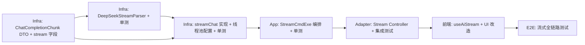

# Phase 4.1: AI 流式输出（SSE）— Implementation Plan

**Branch:** feat/ai-sse-stream
**Baseline SHA:** ad5b66e
**Commit Mode:** per-task
**Effective Execution Mode:** serial
**Started At:** 2026-07-11T00:50:00+08:00
**Updated At:** 2026-07-11T20:30:00+08:00

**Goal:** 为 AI 菜品解析和周计划生成增加 SSE 流式端点，TTFB P95 ≤ 500ms，不改变业务逻辑。
**Architecture:** Domain 层新增 streamChat 接口；Infra 层用 JdkClientHttpRequestFactory + DeepSeekStreamParser 逐行读取；App 层 StreamCmdExe 编排 + chunk 回调；Adapter 层返回 SseEmitter；前端用 fetch + eventsource-parser。
**Tech Stack:** Spring Boot 3.3.13, SseEmitter, JdkClientHttpRequestFactory, RestClient exchange, WireMock, eventsource-parser

## Dependency Graph



| Task | 依赖 | 可并行组 |
|------|------|---------|
| T1 | 无 | A |
| T2 | T1 | B |
| T3 | T1, T2 | — |
| T4 | T3 | — |
| T5 | T4 | — |
| T6 | T5 | — |
| T7 | T6 | — |

---

### T1: Domain 层接口 + Infra DTO 变更

**Depends on:** 无

**Files:**
- Modify: `mealmate-domain/src/main/java/io/yggdrasil/labs/mealmate/domain/common/ai/AiChatGateway.java`
- Modify: `mealmate-infrastructure/src/main/java/io/yggdrasil/labs/mealmate/infrastructure/ai/deepseek/dto/ChatCompletionRequest.java`
- Create: `mealmate-infrastructure/src/main/java/io/yggdrasil/labs/mealmate/infrastructure/ai/deepseek/dto/ChatCompletionChunk.java`

**Behavior:**
AiChatGateway 新增 `streamChat` 方法（保留现有 `chat` 方法不变）。ChatCompletionRequest 新增 `stream` 布尔字段。ChatCompletionChunk 为流式响应的 DTO，包含 delta.content 和 finishReason。

**Acceptance Criteria:**
- [x] AC1: `AiChatGateway` 接口包含 `streamChat(AiChatRequest, AtomicBoolean, Consumer<String>, Consumer<AiChatResult>, Consumer<Exception>)` 方法签名
- [x] AC2: `ChatCompletionRequest` 包含 `@JsonInclude(NON_NULL) Boolean stream` 字段
- [x] AC3: `ChatCompletionChunk` 包含 `choices[].delta.content` 和 `choices[].finishReason` 字段
- [x] AC4: `mealmate-domain` 和 `mealmate-infrastructure` 编译通过
- [x] AC5: 现有 `DeepSeekChatGatewayTest` 仍通过（chat 方法未变）

**Execution:**
- **Status:** done
- **Commit SHA:** c9992f6
- **Attempts:** 1
- **Blocked Reason:** null
- **Red Result:** null
- **Verify Result:** null
- **AC Result:** null

**Task Completion Gate:**
- [x] Red Result exists and passed
- [x] Verify Result exists and passed
- [x] AC Result: total > 0 AND pass + deferred.length == total
- [x] Commit SHA belongs to this task only
- [x] Per-task AC checkbox synced

**Steps:**

**Step 1: Red**
```bash
grep "streamChat" mealmate-domain/src/main/java/io/yggdrasil/labs/mealmate/domain/common/ai/AiChatGateway.java || echo "NOT_EXISTS"
grep "stream" mealmate-infrastructure/src/main/java/io/yggdrasil/labs/mealmate/infrastructure/ai/deepseek/dto/ChatCompletionRequest.java || echo "NOT_EXISTS"
test ! -f mealmate-infrastructure/src/main/java/io/yggdrasil/labs/mealmate/infrastructure/ai/deepseek/dto/ChatCompletionChunk.java && echo "NOT_EXISTS"
```
Expected: 全部 NOT_EXISTS。

**Step 2: Green**

`AiChatGateway.java` — 新增 default 方法（避免破坏现有实现编译）：
```java
default void streamChat(AiChatRequest request, AtomicBoolean cancelled,
                        Consumer<String> onChunk, Consumer<AiChatResult> onComplete,
                        Consumer<Exception> onError) {
    throw new UnsupportedOperationException("Streaming not implemented");
}
```

`ChatCompletionRequest.java` — 新增字段：
```java
private Boolean stream;
```

`ChatCompletionChunk.java` — 新建 DTO，结构见 Design §5.2。

**Step 3: Verify**
```bash
./mvnw compile -pl mealmate-domain,mealmate-infrastructure -am -q
./mvnw test -pl mealmate-infrastructure -Dtest=DeepSeekChatGatewayTest -am -Dsurefire.failIfNoSpecifiedTests=false
```

**Step 4: Commit**
`feat(domain): add streamChat to AiChatGateway + streaming DTOs`

---

### T2: DeepSeekStreamParser + 单测

**Depends on:** T1

**Files:**
- Create: `mealmate-infrastructure/src/main/java/io/yggdrasil/labs/mealmate/infrastructure/ai/deepseek/DeepSeekStreamParser.java`
- Create: `mealmate-infrastructure/src/test/java/io/yggdrasil/labs/mealmate/infrastructure/ai/deepseek/DeepSeekStreamParserTest.java`

**Behavior:**
从 InputStream 逐行读取 SSE 格式数据。解析 `data: ` 前缀行，反序列化为 ChatCompletionChunk，回调 onChunk。遇 `data: [DONE]` 时调用 onDone。每次循环检查 cancelled 标志。IOException 向上抛出。

**Acceptance Criteria:**
- [x] AC1: 正常 SSE 输入（3 个 chunk + [DONE]）→ onChunk 被调用 3 次，每次 delta.content 正确
- [x] AC2: `data: [DONE]` → onDone 被调用，循环结束
- [x] AC3: cancelled=true → 循环提前退出，InputStream 关闭
- [x] AC4: 无效 JSON 行 → 跳过该行不报错，继续解析后续行
- [x] AC5: 空行和 `event:` 行 → 正确忽略

**Execution:**
- **Status:** done
- **Commit SHA:** 2a91693
- **Attempts:** 1
- **Blocked Reason:** null
- **Red Result:** null
- **Verify Result:** null
- **AC Result:** null

**Task Completion Gate:**
- [x] Red Result exists and passed
- [x] Verify Result exists and passed
- [x] AC Result: total > 0 AND pass + deferred.length == total
- [x] Commit SHA belongs to this task only
- [x] Per-task AC checkbox synced

**Steps:**

**Step 1: Red**
```bash
test ! -f mealmate-infrastructure/src/main/java/io/yggdrasil/labs/mealmate/infrastructure/ai/deepseek/DeepSeekStreamParser.java && echo "NOT_EXISTS"
```

**Step 2: Green**
实现 DeepSeekStreamParser：BufferedReader 逐行读取 → 过滤空行和 event: 行 → 提取 `data: ` 后内容 → `[DONE]` 检测 → Jackson 反序列化 → onChunk 回调。每次 readLine 前检查 cancelled。try-with-resources 包裹 InputStream。

编写 DeepSeekStreamParserTest：用 ByteArrayInputStream 构造固化 SSE 文本输入。

**Step 3: Verify**
```bash
./mvnw test -pl mealmate-infrastructure -Dtest=DeepSeekStreamParserTest -am -Dsurefire.failIfNoSpecifiedTests=false
```

**Step 4: Commit**
`feat(infra): add DeepSeekStreamParser for SSE line parsing`

---

### T3: DeepSeekChatGateway.streamChat 实现 + 流式配置 + 单测

**Depends on:** T1, T2

**Files:**
- Modify: `mealmate-infrastructure/src/main/java/io/yggdrasil/labs/mealmate/infrastructure/ai/deepseek/DeepSeekChatGateway.java`
- Modify: `mealmate-infrastructure/src/main/java/io/yggdrasil/labs/mealmate/infrastructure/ai/deepseek/DeepSeekConfig.java`
- Create: `mealmate-infrastructure/src/main/java/io/yggdrasil/labs/mealmate/infrastructure/ai/config/AiStreamAsyncConfig.java`
- Create: `mealmate-infrastructure/src/test/java/io/yggdrasil/labs/mealmate/infrastructure/ai/deepseek/DeepSeekChatGatewayStreamTest.java`

**Behavior:**
DeepSeekChatGateway 实现 streamChat：构建 stream=true 请求 → 用流式 RestClient exchange 获取 ClientHttpResponse → 委托 Parser → 累积 content → 构建 AiChatResult 回调 onComplete。DeepSeekConfig 新增 `deepSeekStreamRestClient` Bean（JdkClientHttpRequestFactory）。AiStreamAsyncConfig 新增线程池 Bean。单测用 WireMock 模拟 chunked 响应。

**Acceptance Criteria:**
- [x] AC1: streamChat 正常流程 → onChunk 按序回调每个 delta.content 片段
- [x] AC2: 流式结束后 onComplete 携带拼接后的完整 content + token 统计
- [x] AC3: DeepSeek 返回 500 → onError 回调 BizException(AI_SERVICE_UNAVAILABLE)
- [x] AC4: cancelled=true 中途设置 → 流式读取提前终止
- [x] AC5: `deepSeekStreamRestClient` Bean 使用 JdkClientHttpRequestFactory
- [x] AC6: `aiStreamExecutor` Bean core=4, max=8, queue=32

**Execution:**
- **Status:** done
- **Commit SHA:** 5c2b297
- **Attempts:** 1
- **Blocked Reason:** null
- **Red Result:** null
- **Verify Result:** null
- **AC Result:** null

**Task Completion Gate:**
- [x] Red Result exists and passed
- [x] Verify Result exists and passed
- [x] AC Result: total > 0 AND pass + deferred.length == total
- [x] Commit SHA belongs to this task only
- [x] Per-task AC checkbox synced

**Steps:**

**Step 1: Red**
```bash
grep "streamChat" mealmate-infrastructure/src/main/java/io/yggdrasil/labs/mealmate/infrastructure/ai/deepseek/DeepSeekChatGateway.java || echo "NOT_EXISTS"
grep "deepSeekStreamRestClient" mealmate-infrastructure/src/main/java/io/yggdrasil/labs/mealmate/infrastructure/ai/deepseek/DeepSeekConfig.java || echo "NOT_EXISTS"
test ! -f mealmate-infrastructure/src/main/java/io/yggdrasil/labs/mealmate/infrastructure/ai/config/AiStreamAsyncConfig.java && echo "NOT_EXISTS"
```

**Step 2: Green**
实现 streamChat（exchange + try-with-resources + Parser + onChunk/onComplete/onError）。
新增 deepSeekStreamRestClient Bean（JdkClientHttpRequestFactory, readTimeout=30s）。
新增 AiStreamAsyncConfig（ThreadPoolTaskExecutor, core=4, max=8, queue=32）。
编写 WireMock 单测：模拟 chunked `Transfer-Encoding: chunked` + `text/event-stream` 响应。

**Step 3: Verify**
```bash
./mvnw test -pl mealmate-infrastructure -Dtest=DeepSeekChatGatewayStreamTest -am -Dsurefire.failIfNoSpecifiedTests=false
./mvnw compile -pl mealmate-infrastructure -am -q
```

**Step 4: Commit**
`feat(infra): implement streamChat with JdkClientHttpRequestFactory + async config`

---

### T4: App 层 StreamCmdExe 编排 + 单测

**Depends on:** T3

**Files:**
- Create: `mealmate-app/src/main/java/io/yggdrasil/labs/mealmate/app/recipe/executor/AiRecipeParseStreamCmdExe.java`
- Create: `mealmate-app/src/main/java/io/yggdrasil/labs/mealmate/app/mealplan/executor/AiMealPlanGenerateStreamCmdExe.java`
- Modify: `mealmate-app/src/main/java/io/yggdrasil/labs/mealmate/app/recipe/application/AiRecipeAppService.java`
- Modify: `mealmate-app/src/main/java/io/yggdrasil/labs/mealmate/app/mealplan/application/AiMealPlanAppService.java`
- Create: `mealmate-app/src/test/java/io/yggdrasil/labs/mealmate/app/recipe/executor/AiRecipeParseStreamCmdExeTest.java`
- Create: `mealmate-app/src/test/java/io/yggdrasil/labs/mealmate/app/mealplan/executor/AiMealPlanGenerateStreamCmdExeTest.java`

**Behavior:**
AiRecipeParseStreamCmdExe：loadSession → sanitize → buildMessages → streamChat(onChunk 透传, onComplete 时 parseJson+merge+persist+onResult)。AiMealPlanGenerateStreamCmdExe：validate → context → prompt → streamChat(onChunk 透传, onComplete 时 parse+validate+persist, onError 时 fallback 规则引擎+onResult(fallback=true))。AppService 新增 chatStream/generateStream facade 方法。

**Acceptance Criteria:**
- [x] AC1: Recipe stream — onChunk 收到 3 次，onResult 收到完整的 AiRecipeParseResultCO（status+parsed+sessionId）
- [x] AC2: Recipe stream — LLM 返回 invalid JSON → onResult(parsed=null, status 不变)
- [x] AC3: MealPlan stream — 正常流程 → onResult(fallback=false, reasoning 非空)
- [x] AC4: MealPlan stream — streamChat onError → fallback 规则引擎 → onResult(fallback=true)
- [x] AC5: 同一 sessionId 正在处理中 → BizException(AI_SESSION_BUSY) 通过 onError 传递

**Execution:**
- **Status:** done
- **Commit SHA:** 1526e9d
- **Attempts:** 1
- **Blocked Reason:** null
- **Red Result:** null
- **Verify Result:** null
- **AC Result:** null

**Task Completion Gate:**
- [x] Red Result exists and passed
- [x] Verify Result exists and passed
- [x] AC Result: total > 0 AND pass + deferred.length == total
- [x] Commit SHA belongs to this task only
- [x] Per-task AC checkbox synced

**Steps:**

**Step 1: Red**
```bash
test ! -f mealmate-app/src/main/java/io/yggdrasil/labs/mealmate/app/recipe/executor/AiRecipeParseStreamCmdExe.java && echo "NOT_EXISTS"
test ! -f mealmate-app/src/main/java/io/yggdrasil/labs/mealmate/app/mealplan/executor/AiMealPlanGenerateStreamCmdExe.java && echo "NOT_EXISTS"
```

**Step 2: Green**
实现两个 StreamCmdExe（复用同步版的 session/cache/sanitize/prompt/parse/persist 逻辑，区别仅在于调用 streamChat 而非 chat，并通过回调转发 chunk）。AppService 新增 facade 方法。
单测 Mock gateway.streamChat（手动调用回调参数模拟流式），验证编排逻辑。

**Step 3: Verify**
```bash
./mvnw test -pl mealmate-app -Dtest="AiRecipeParseStreamCmdExeTest,AiMealPlanGenerateStreamCmdExeTest" -am -Dsurefire.failIfNoSpecifiedTests=false
./mvnw compile -pl mealmate-app -am -q
```

**Step 4: Commit**
`feat(app): add streaming executors for recipe parse and meal plan generate`

---

### T5: Adapter 层 Stream Controller + 集成测试

**Depends on:** T4

**Files:**
- Create: `mealmate-adapter/src/main/java/io/yggdrasil/labs/mealmate/adapter/web/ai/AiRecipeStreamController.java`
- Create: `mealmate-adapter/src/main/java/io/yggdrasil/labs/mealmate/adapter/web/ai/AiMealPlanStreamController.java`
- Create: `mealmate-adapter/src/test/java/io/yggdrasil/labs/mealmate/adapter/web/ai/AiRecipeStreamControllerTest.java`
- Create: `mealmate-start/src/test/java/io/yggdrasil/labs/mealmate/start/AiRecipeStreamApiIntegrationTest.java`

**Behavior:**
AiRecipeStreamController 暴露 `POST /api/ai/recipes/chat/stream`，返回 SseEmitter(60s)。注入 aiStreamExecutor，异步执行 chatStream。设置 onCompletion/onTimeout/onError 回调设置 cancelled 标志。AiMealPlanStreamController 暴露 `POST /api/ai/meal-plans/generate/stream`，结构相同。集成测试用 WireMock 模拟 DeepSeek chunked 响应，验证 SSE 事件序列。

**Acceptance Criteria:**
- [x] AC1: `POST /api/ai/recipes/chat/stream` → Content-Type: text/event-stream + chunk events + done + result event
- [x] AC2: `POST /api/ai/meal-plans/generate/stream` → Content-Type: text/event-stream + chunk events + done + result event
- [x] AC3: DeepSeek 不可用 → error event（菜品）或 error + fallback result event（计划）
- [x] AC4: 现有同步端点 `/api/ai/recipes/chat` 和 `/api/ai/meal-plans/generate` 仍正常工作

**Execution:**
- **Status:** done
- **Commit SHA:** 18deec7
- **Attempts:** 1
- **Blocked Reason:** null
- **Red Result:** null
- **Verify Result:** null
- **AC Result:** null

**Task Completion Gate:**
- [x] Red Result exists and passed
- [x] Verify Result exists and passed
- [x] AC Result: total > 0 AND pass + deferred.length == total
- [x] Commit SHA belongs to this task only
- [x] Per-task AC checkbox synced

**Steps:**

**Step 1: Red**
```bash
grep "AiRecipeStreamController" mealmate-adapter/src/main/java -r || echo "NOT_EXISTS"
grep "AiMealPlanStreamController" mealmate-adapter/src/main/java -r || echo "NOT_EXISTS"
```

**Step 2: Green**
创建两个 Stream Controller（SseEmitter + cancelled + aiStreamExecutor + 回调转发）。
创建 Controller 单测（MockMvc 验证 Content-Type）。
创建集成测试（WireMock chunked → 验证 SSE 事件序列 chunk/done/result）。

**Step 3: Verify**
```bash
./mvnw test -pl mealmate-adapter -Dtest="AiRecipeStreamControllerTest" -am -Dsurefire.failIfNoSpecifiedTests=false
./mvnw test -pl mealmate-start -Dtest="AiRecipeStreamApiIntegrationTest" -am -Dsurefire.failIfNoSpecifiedTests=false
# 确认现有测试无回归
./mvnw test -pl mealmate-adapter,mealmate-start -am -Dsurefire.failIfNoSpecifiedTests=false
```

**Step 4: Commit**
`feat(adapter): add SSE stream controllers for AI recipe and meal plan`

---

### T6: 前端 useAiStream + UI 改造

**Depends on:** T5

**Files:**
- Create: `mealmate-web/src/composables/useAiStream.ts`
- Modify: `mealmate-web/src/composables/useAiChat.ts`
- Modify: `mealmate-web/src/modules/recipe/api.ts`
- Modify: `mealmate-web/src/modules/meal-plan/api.ts`
- Modify: `mealmate-web/src/pages/weekly-meal-plan.vue`
- Modify: `mealmate-web/package.json` (新增 eventsource-parser 依赖)

**Behavior:**
新增 useAiStream composable（fetch + ReadableStream + eventsource-parser 解析 SSE 事件）。useAiChat.send() 改为调用流式端点 `/api/ai/recipes/chat/stream`，逐步追加 assistant 消息内容。aiGeneratePlan 改为调用 `/api/ai/meal-plans/generate/stream`。weekly-meal-plan.vue 展示打字机效果 + 流式 loading 状态。支持 abort。

**Acceptance Criteria:**
- [x] AC1: useAiStream.stream() 正确解析 chunk/done/result/error 四种事件
- [x] AC2: useAiChat.send() 调用流式端点，messages 中 assistant 内容逐步增长（打字机效果）
- [x] AC3: abort() 调用后 fetch 连接断开，loading 变为 false
- [x] AC4: TypeScript + vue-tsc 编译无错误
- [x] AC5: pnpm lint 通过

**Execution:**
- **Status:** done
- **Commit SHA:** fcecea8
- **Attempts:** 1
- **Blocked Reason:** null
- **Red Result:** null
- **Verify Result:** null
- **AC Result:** null

**Task Completion Gate:**
- [x] Red Result exists and passed
- [x] Verify Result exists and passed
- [x] AC Result: total > 0 AND pass + deferred.length == total
- [x] Commit SHA belongs to this task only
- [x] Per-task AC checkbox synced

**Steps:**

**Step 1: Red**
```bash
test ! -f mealmate-web/src/composables/useAiStream.ts && echo "NOT_EXISTS"
grep "eventsource-parser" mealmate-web/package.json || echo "NOT_EXISTS"
```

**Step 2: Green**
安装 eventsource-parser：`pnpm add eventsource-parser`。
创建 useAiStream.ts（fetch + createParser + AbortController）。
修改 useAiChat.ts：send 改为流式调用，assistant 消息逐步追加。
修改 api.ts 新增流式 URL 常量。
修改 weekly-meal-plan.vue：AI 生成改用流式，展示生成中文字。

**Step 3: Verify**
```bash
cd mealmate-web && source ~/.nvm/nvm.sh && pnpm type-check && pnpm lint
```

**Step 4: Commit**
`feat(web): add SSE streaming support with useAiStream composable`

---

### T7: E2E 流式全链路测试（含 local 模式回归）

**Depends on:** T6

**Files:**
- Create: `mealmate-e2e/tests/specs/feature/ai-stream.spec.ts`
- Create: `mealmate-e2e/tests/fixtures/sse-mock-server.ts`
- Create: `mealmate-e2e/tests/cases/ai-stream-fixtures.json`
- Modify: `mealmate-e2e/env/compose/docker-compose.e2e.yml` (新增 mock-ai service)
- Modify: `mealmate-e2e/Makefile` (新增 local 模式 target)
- Modify: `mealmate-e2e/.env.example`

**Behavior:**
E2E 支持两种模式运行：
1. **live 模式**（默认）：走真实 DeepSeek API（需 DEEPSEEK_API_KEY），验证真实 AI 交互端到端。
2. **local 模式**：使用本地 mock-ai 服务替代 DeepSeek，返回固化的 SSE chunked 响应。无需外部 API 依赖，CI/离线环境可回归。

local 模式实现方式：
- 新增一个轻量 Node.js mock 服务（`sse-mock-server.ts`），监听 `/chat/completions`
- 当请求中 `stream: true` 时，按固化 fixture 逐 chunk 返回 SSE 格式响应（模拟延迟 50ms/chunk）
- 当 `stream: false` 时，返回完整 JSON 响应（兼容现有同步测试）
- docker-compose 中新增 `mock-ai` service（Node.js HTTP 服务），仅在 `MOCK_AI=true` 时 backend 的 `DEEPSEEK_BASE_URL` 指向它
- `make feature-local` 一键启动 local 模式测试

**Local 模式 E2E 验收项：**
1. 流式打字机效果：mock 返回 5 个 chunk（间隔 50ms）→ 前端 DOM 文字至少更新 3 次（非一次性渲染）
2. done + result 事件：流式结束后前端正确收到完整业务结果并更新 UI
3. 错误处理：mock 返回 500 → 前端展示错误提示（菜品）/ fallback 提示（计划）
4. abort：用户点击停止 → 连接断开，已显示内容保留
5. 向后兼容：现有非流式功能（confirm、规则引擎生成）在 local 模式下仍正常

**Acceptance Criteria:**
- [x] AC1: `make feature-local spec=tests/specs/feature/ai-stream.spec.ts` 全部通过（无需 DEEPSEEK_API_KEY）
- [x] AC2: 打字机效果可观察（DOM 文字长度至少经历 3 次递增）
- [x] AC3: mock-ai 服务 stream 响应格式与真实 DeepSeek SSE 协议一致（data: {json}\n\n + data: [DONE]\n\n）
- [x] AC4: `make feature`（live 模式，有 API Key 时）现有 AI spec 无回归
- [x] AC5: TypeScript 编译通过

**Execution:**
- **Status:** done
- **Commit SHA:** 479d0bb
- **Attempts:** 1
- **Blocked Reason:** null
- **Red Result:** null
- **Verify Result:** null
- **AC Result:** null

**Task Completion Gate:**
- [x] Red Result exists and passed
- [x] Verify Result exists and passed
- [x] AC Result: total > 0 AND pass + deferred.length == total
- [x] Commit SHA belongs to this task only
- [x] Per-task AC checkbox synced

**Steps:**

**Step 1: Red**
```bash
test ! -f mealmate-e2e/tests/specs/feature/ai-stream.spec.ts && echo "NOT_EXISTS"
test ! -f mealmate-e2e/tests/fixtures/sse-mock-server.ts && echo "NOT_EXISTS"
```

**Step 2: Green**

**sse-mock-server.ts** — 轻量 Node.js HTTP 服务（~100 行）：
```typescript
// 监听 POST /chat/completions
// 读 request body → 判断 stream 字段
// stream=true:
//   从 fixture 加载 chunks 列表（5 个文本片段）
//   逐个返回 SSE 行（data: {"choices":[{"delta":{"content":"片段N"}}]}\n\n）
//   每 chunk 间隔 50ms（模拟真实延迟）
//   最终 data: {"choices":[{"delta":{},"finish_reason":"stop"}],"usage":{...}}\n\n
//   最终 data: [DONE]\n\n
// stream=false:
//   返回完整 ChatCompletionResponse JSON（复用 fixture 中 chunks 拼接的完整 content）
```

**ai-stream-fixtures.json** — 固化测试数据：
```json
{
  "recipeChat": {
    "chunks": ["我帮你", "整理了", "菜品信息", "：番茄炒蛋", "，请确认"],
    "fullContent": "{\"name\":\"番茄炒蛋\",\"ingredients\":[...],\"steps\":[...]}",
    "usage": {"prompt_tokens": 200, "completion_tokens": 50, "total_tokens": 250}
  },
  "mealPlanGenerate": {
    "chunks": ["正在为", "您的家庭", "规划本周", "饮食方案", "，请稍候"],
    "fullContent": "{\"days\":[...]}",
    "usage": {"prompt_tokens": 500, "completion_tokens": 300, "total_tokens": 800}
  }
}
```

**docker-compose.e2e.yml 新增 mock-ai service：**
```yaml
  mock-ai:
    image: node:22-slim
    working_dir: /app
    volumes:
      - ../../tests/fixtures:/app
    command: node --experimental-strip-types sse-mock-server.ts
    ports: ['19090:9090']
    healthcheck:
      test: [CMD-SHELL, 'curl -sf http://localhost:9090/health || exit 1']
      interval: 3s
      retries: 5
    profiles: ['local']
```

**Makefile 新增 local 模式：**
```makefile
feature-local:  ## local 模式 E2E（mock AI，无需 API Key）
	@MOCK_AI=true DEEPSEEK_BASE_URL=http://mock-ai:9090 $(call run-e2e,pnpm test:feature $(if $(spec),$(spec)))
```

**ai-stream.spec.ts** 核心测试：
```typescript
test.describe('AI 流式输出', () => {
  test('菜品解析 — 打字机效果 + 最终结果', async ({ page }) => {
    await page.goto('/recipes')
    await page.click('[data-testid="ai-recipe-btn"]')
    await page.fill('[data-testid="chat-input"]', '番茄炒蛋')
    await page.click('[data-testid="send-btn"]')

    // 验证打字机效果：文字长度至少递增 3 次
    const textLengths: number[] = []
    for (let i = 0; i < 10; i++) {
      const len = await page.evaluate(() =>
        document.querySelector('[data-testid="assistant-message-streaming"]')?.textContent?.length ?? 0
      )
      if (len > 0 && (textLengths.length === 0 || len > textLengths[textLengths.length - 1]))
        textLengths.push(len)
      await page.waitForTimeout(100)
    }
    expect(textLengths.length).toBeGreaterThanOrEqual(3)

    // 验证最终结果展示
    await expect(page.locator('[data-testid="parsed-name"]')).toBeVisible({ timeout: 15_000 })
  })

  test('周计划生成 — 流式 + reasoning 展示', async ({ page }) => {
    await page.goto('/weekly-meal-plan')
    await page.click('[data-testid="ai-generate-btn"]')
    await page.fill('[data-testid="user-hint-input"]', '清淡饮食')
    await page.click('[data-testid="ai-generate-confirm"]')

    // 验证流式文字出现
    await expect(page.locator('[data-testid="ai-stream-text"]')).toBeVisible({ timeout: 5_000 })

    // 验证最终计划展示
    await expect(page.locator('[data-testid="meal-plan-card"]')).toBeVisible({ timeout: 15_000 })
  })

  test('AI 不可用 — 错误提示', async ({ page }) => {
    // 配合 mock-ai 的 /simulate-error 端点
    // ...
  })

  test('用户停止生成 — 已有内容保留', async ({ page }) => {
    // 点击 stop → 验证 text 不为空
    // ...
  })
})
```

**Step 3: Verify**
```bash
cd mealmate-e2e && npx tsc --noEmit
# local 模式验证（无需真实 API Key）
make feature-local spec=tests/specs/feature/ai-stream.spec.ts
```

**Step 4: Commit**
`test(e2e): add AI streaming E2E tests with local mock mode`

---

## Acceptance Criteria (Feature Level)

以下为功能级验收条件，所有 Task 完成后逐一验证。与 per-Task AC 不重复。

- [x] AC-F1: 用户在 AI 菜品录入中输入描述后，500ms 内看到首个文字出现（打字机效果），无需等待 3-8s
- [x] AC-F2: 用户在 AI 周计划生成中，500ms 内看到生成过程文字，最终计划和 reasoning 正确展示
- [x] AC-F3: 用户点击"停止生成"→ 流式中断，已显示内容保留，不影响后续操作
- [x] AC-F4: DeepSeek 不可用时，菜品解析显示错误；周计划 fallback 到规则引擎并提示用户
- [x] AC-F5: 现有同步端点（`/api/ai/recipes/chat`、`/api/ai/meal-plans/generate`、`/api/ai/recipes/confirm`）行为不变
- [x] AC-F6: 现有测试套件无回归
- [x] AC-F7: `make feature-local`（local 模式）全部 AI 相关 spec 通过，无需 DEEPSEEK_API_KEY

---

## 实施概览

| Task | 描述 | 预估 | 依赖 |
|------|------|------|------|
| T1 | Domain 接口 + Infra DTO | 0.5d | 无 |
| T2 | DeepSeekStreamParser + 单测 | 1d | T1 |
| T3 | streamChat 实现 + 配置 + 单测 | 1d | T1, T2 |
| T4 | App StreamCmdExe + 单测 | 1.5d | T3 |
| T5 | Stream Controller + 集成测试 | 1d | T4 |
| T6 | 前端 useAiStream + UI 改造 | 1.5d | T5 |
| T7 | E2E 流式测试 + local mock 模式 | 1.5d | T6 |

总计：8 天（backend 4d, frontend 1.5d, e2e 1.5d, buffer 1d）
