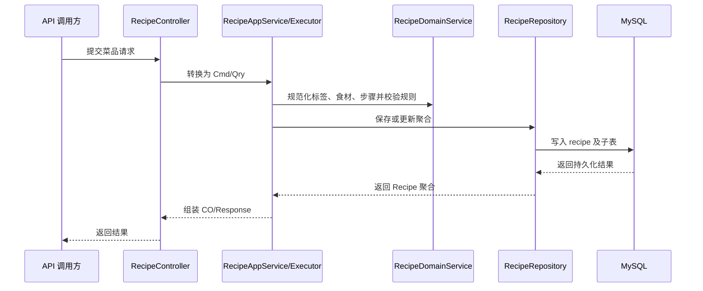

> 本文档承接 spec.md，回答"怎么做"。同目录下的 spec.md 和 plan.md 共享相同 slug。

# 设计文档：菜品库管理（uc2-recipe）

## 背景

UC2 为后续周计划、采购和营养复盘提供结构化菜品输入。实现采用现有 COLA 分层：Adapter 暴露 HTTP API，App 负责用例编排和事务，Domain 承载菜品规则，Infrastructure 负责 MyBatis-Plus 持久化和聚合装配。

## 技术方案

### 数据模型

| 表/模型 | 说明 | 关键字段 |
|---------|------|----------|
| `recipe` | 菜品聚合根 | `name`, `recipe_type`, `source_type`, `season_tag`, `crowd_tag`, `taste_tag`, `difficulty_level`, `cooking_time_min`, `status`, `deleted` |
| `recipe_ingredient` | 菜品食材子对象 | `recipe_id`, `ingredient_name`, `ingredient_type`, `quantity`, `unit`, `is_main`, `sort_no` |
| `recipe_step` | 菜品步骤子对象 | `recipe_id`, `step_no`, `content`, `image_url` |
| `recipe_nutrition` | 菜品营养值对象 | `recipe_id`, `calories`, `protein`, `fat`, `carbohydrate`, `fiber`, `calcium`, `sodium`, `nutrition_json` |

领域模型以 `Recipe` 为聚合根，包含 `RecipeIngredient`、`RecipeStep` 和 `NutritionFact`。`recipe.deleted` 使用逻辑删除标记，删除时回填当前主键以允许同名菜品重新创建。

### 接口契约

| 方法 | 路径 | 用途 |
|------|------|------|
| `GET` | `/api/recipes` | 分页查询菜品，支持关键字、类型、季节、人群、宝宝友好、减脂友好、难度、最大烹饪时长筛选 |
| `GET` | `/api/recipes/search` | 按关键字搜索菜品 |
| `GET` | `/api/recipes/{recipeId}` | 查询菜品详情 |
| `POST` | `/api/recipes` | 创建手动菜品 |
| `PUT` | `/api/recipes/{recipeId}` | 更新菜品基础信息 |
| `PUT` | `/api/recipes/{recipeId}/ingredients` | 全量替换菜品食材 |
| `PUT` | `/api/recipes/{recipeId}/steps` | 全量替换菜品步骤 |
| `PUT` | `/api/recipes/{recipeId}/nutrition` | 更新菜品营养信息 |
| `PUT` | `/api/recipes/{recipeId}/status` | 更新菜品状态 |
| `DELETE` | `/api/recipes/{recipeId}` | 删除手动菜品 |

### 核心流程

## 影响范围

| 模块/文件 | 变更类型 | 说明 |
|-----------|----------|------|
| `mealmate-start/src/main/resources/db/migration/V4__create_recipe_tables.sql` | 新增 | 创建 UC2 四张菜品相关表 |
| `mealmate-domain/src/main/java/.../domain/recipe/` | 新增 | 菜品聚合、枚举、领域服务、仓储接口 |
| `mealmate-app/src/main/java/.../app/recipe/` | 新增 | AppService、DTO、Convertor、Assembler、Cmd/Qry Executor |
| `mealmate-infrastructure/src/main/java/.../persistence/recipe/` | 新增 | DO、InfraConvertor、MyBatis-Plus 数据对象服务 |
| `mealmate-infrastructure/src/main/java/.../persistence/impl/RecipeRepositoryImpl.java` | 新增 | 菜品仓储实现与聚合装配 |
| `mealmate-adapter/src/main/java/.../adapter/web/recipe/` | 新增 | REST Controller、Web DTO、Web Convertor |
| `mealmate-*/src/test/java/.../recipe/` | 新增 | Domain/App/Adapter/Infrastructure/Start 测试 |

## 约束（智能体必须遵守）

- `adapter` 不直接依赖 `domain` 或 `infrastructure`，只依赖 `app`。
- `app` 负责事务边界和用例编排，不直接访问 DO 或 MyBatis-Plus Service。
- `domain` 不依赖 Spring、Web DTO 或数据库对象。
- `infrastructure` 负责聚合与表结构转换，不能把 DO 泄漏到上层。
- 手动菜品创建时来源为 `MANUAL`，状态默认为 `ACTIVE`。
- 系统来源菜品禁止普通编辑和删除。
- 食材列表不能为空；步骤列表可为空但需要按顺序规范化。
- 营养数值不能为负数。
- 查询默认排除逻辑删除菜品。

## 迁移与兼容

- **Schema migration**：`mealmate-start/src/main/resources/db/migration/V4__create_recipe_tables.sql`
- **数据回填（backfill）**：不需要，UC2 为新表。
- **向后兼容**：新增 API 和新表，不修改 UC1 家庭成员接口；逻辑删除允许同名菜品复用。
- **Feature flag**：不使用。

## 发布与回滚

- **发布策略**：随后端版本全量发布；Flyway 自动应用 V4 migration。
- **回滚方案**：代码回滚到上一版本；如数据库已迁移且无生产数据，可人工删除 UC2 四张表；如已有生产数据，保留表并停止暴露 UC2 API。
- **回滚触发条件**：迁移失败、菜品创建接口持续失败、删除或名称唯一规则导致数据异常。

## 观测性

- **关键指标**：HTTP 成功率、接口耗时、数据库写入失败数。
- **告警规则**：复用现有服务级 HTTP 5xx 和应用异常告警。
- **日志/追踪**：复用现有访问日志、异常日志和 SQL 日志。

## 异常处理

| 场景 | 技术处理方式 |
|------|-------------|
| 请求参数缺失 | Adapter 使用 Jakarta Validation 拦截 |
| 菜品名称重复 | App 创建前通过 `RecipeRepository.findByName` 校验 |
| 系统菜品被编辑或删除 | Domain `assertRecipeEditable` / `assertRecipeDeletable` 拒绝 |
| 营养值为负 | Domain `validateNutritionFact` 拒绝 |
| 子表替换 | Infrastructure 先按 `recipe_id` 删除旧子表，再写入新列表 |
| 逻辑删除 | 删除子表数据，并将 `recipe.deleted` 更新为当前主键 |

## 验证方式

- 单元测试：
  - `RecipeDomainServiceTest` 覆盖标签规范化、食材/步骤排序、宝宝友好规则、营养非负、系统菜品保护。
  - `mealmate-app` recipe executor 测试覆盖创建、更新、分页、搜索、详情、状态、删除。
  - `RecipeInfraConvertorTest` 覆盖 enum/string、口味标签、营养扩展 JSON 和子对象转换。
  - `RecipeRepositoryImplTest` 覆盖查询、筛选、保存、子表替换、营养 upsert、逻辑删除。
  - `RecipeControllerTest` 覆盖 Web 参数校验和 API 适配。
- 集成测试：
  - `CreateRecipeApiIntegrationTest` 覆盖 HTTP 创建并持久化子表、分页筛选、删除后同名复用。
- 性能测试：不适用。

## 备选方案

| 方案 | 优势 | 否决原因 |
|------|------|----------|
| 将食材、步骤、营养全部存为 JSON | 表少，创建快 | 后续计划、采购、营养分析难以结构化查询和演进 |
| 只实现菜品主表，子对象后续补 | 首版范围更小 | 不能支撑周计划和营养复盘的真实输入 |
| 当前四表聚合方案 | 聚合边界清晰，支撑查询和后续扩展 | 实现成本高于单表 JSON，但符合长期业务闭环 |

## 参考资料

- [ARCHITECTURE.md](../../../ARCHITECTURE.md)
- [docs/generated/db-schema.md](../../generated/db-schema.md)
- [docs/design-docs/domain-context.md](../../design-docs/domain-context.md)
