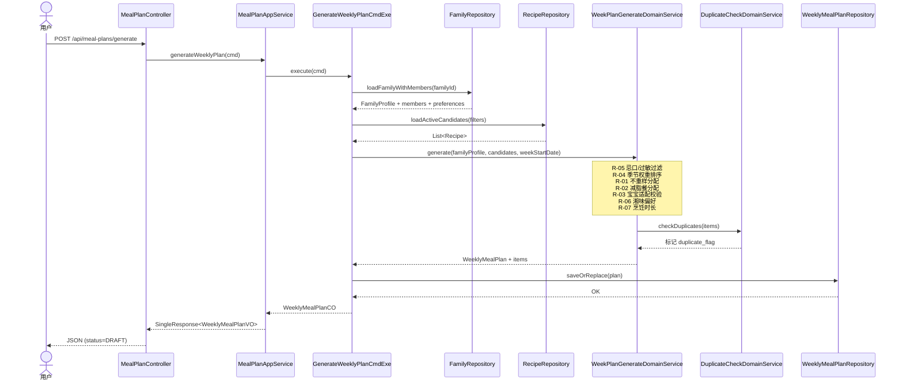
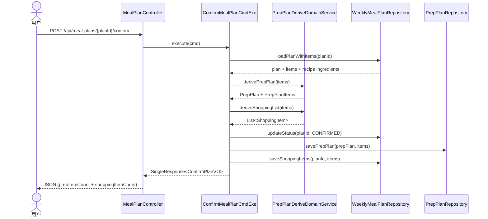

# 设计文档：UC3 生成周计划

## 背景

MealMate 已具备家庭画像管理和菜品库管理能力，需要将两者串联为自动化的一周三餐用餐计划。本设计覆盖周计划生成、手动调整、确认及确认后派生备菜计划与采购清单的完整链路。

## 技术方案

### 数据模型

#### weekly_meal_plan — 周计划主表

| 字段 | 类型 | 说明 | 约束 |
|------|------|------|------|
| id | BIGINT | 主键 | PK, AUTO_INCREMENT |
| family_id | BIGINT | 家庭ID | NOT NULL |
| week_start_date | DATE | 周起始日期（周一） | NOT NULL |
| week_end_date | DATE | 周结束日期（周日） | NOT NULL |
| status | VARCHAR(16) | DRAFT/CONFIRMED/ARCHIVED | NOT NULL, DEFAULT 'DRAFT' |
| plan_source | VARCHAR(16) | MANUAL/AI_GENERATED | NOT NULL, DEFAULT 'MANUAL' |
| rule_snapshot_json | JSON | 生成时规则快照 | NULL |
| remark | VARCHAR(255) | 备注 | NULL |
| generated_time | DATETIME | 生成时间 | NULL |
| created_at | DATETIME | 创建时间 | NOT NULL |
| updated_at | DATETIME | 更新时间 | NOT NULL |
| created_by | BIGINT | 创建人 | NOT NULL, DEFAULT 0 |
| updated_by | BIGINT | 更新人 | NOT NULL, DEFAULT 0 |
| deleted | TINYINT | 逻辑删除 | NOT NULL, DEFAULT 0 |

**索引**：`uk_family_week(family_id, week_start_date)`、`idx_family_status_deleted(family_id, status, deleted)`

#### meal_plan_item — 餐次明细表

| 字段 | 类型 | 说明 | 约束 |
|------|------|------|------|
| id | BIGINT | 主键 | PK, AUTO_INCREMENT |
| plan_id | BIGINT | 周计划ID | NOT NULL |
| meal_date | DATE | 餐次日期 | NOT NULL |
| meal_type | VARCHAR(16) | BREAKFAST/LUNCH/DINNER | NOT NULL |
| recipe_id | BIGINT | 菜品ID | NOT NULL |
| crowd_type | VARCHAR(32) | 适配人群 | NULL |
| is_weight_loss | TINYINT | 是否减脂餐 | NOT NULL, DEFAULT 0 |
| is_baby_meal | TINYINT | 是否宝宝餐 | NOT NULL, DEFAULT 0 |
| duplicate_flag | TINYINT | 重复预警 | NOT NULL, DEFAULT 0 |
| sort_order | INT | 排序号 | NOT NULL, DEFAULT 0 |
| remark | VARCHAR(255) | 备注 | NULL |
| created_at | DATETIME | 创建时间 | NOT NULL |
| updated_at | DATETIME | 更新时间 | NOT NULL |
| created_by | BIGINT | 创建人 | NOT NULL, DEFAULT 0 |
| updated_by | BIGINT | 更新人 | NOT NULL, DEFAULT 0 |

**索引**：`idx_plan_date_type(plan_id, meal_date, meal_type)`、`idx_recipe_id(recipe_id)`、`idx_plan_crowd(plan_id, crowd_type)`

**物理删除**，随主表覆盖时全量替换。

#### prep_plan — 备菜计划主表

| 字段 | 类型 | 说明 | 约束 |
|------|------|------|------|
| id | BIGINT | 主键 | PK, AUTO_INCREMENT |
| plan_id | BIGINT | 周计划ID | NOT NULL, UNIQUE |
| push_status | VARCHAR(16) | INIT/SENT/FAILED | NOT NULL, DEFAULT 'INIT' |
| generated_time | DATETIME | 生成时间 | NOT NULL |
| remark | VARCHAR(255) | 备注 | NULL |
| created_at | DATETIME | 创建时间 | NOT NULL |
| updated_at | DATETIME | 更新时间 | NOT NULL |
| created_by | BIGINT | 创建人 | NOT NULL, DEFAULT 0 |
| updated_by | BIGINT | 更新人 | NOT NULL, DEFAULT 0 |
| deleted | TINYINT | 逻辑删除 | NOT NULL, DEFAULT 0 |

#### prep_plan_item — 备菜明细表

| 字段 | 类型 | 说明 | 约束 |
|------|------|------|------|
| id | BIGINT | 主键 | PK, AUTO_INCREMENT |
| prep_plan_id | BIGINT | 备菜计划ID | NOT NULL |
| ingredient_name | VARCHAR(64) | 食材名称 | NOT NULL |
| quantity | DECIMAL(10,2) | 备菜数量 | NULL |
| unit | VARCHAR(16) | 单位 | NULL |
| storage_method | VARCHAR(64) | 保存方式 | NULL |
| priority | VARCHAR(16) | HIGH/NORMAL/LOW | NOT NULL, DEFAULT 'NORMAL' |
| task_status | VARCHAR(16) | TODO/DONE | NOT NULL, DEFAULT 'TODO' |
| remark | VARCHAR(255) | 备注 | NULL |
| created_at | DATETIME | 创建时间 | NOT NULL |
| updated_at | DATETIME | 更新时间 | NOT NULL |
| created_by | BIGINT | 创建人 | NOT NULL, DEFAULT 0 |
| updated_by | BIGINT | 更新人 | NOT NULL, DEFAULT 0 |

#### shopping_item — 采购清单表

| 字段 | 类型 | 说明 | 约束 |
|------|------|------|------|
| id | BIGINT | 主键 | PK, AUTO_INCREMENT |
| plan_id | BIGINT | 周计划ID | NOT NULL |
| ingredient_name | VARCHAR(64) | 食材名称 | NOT NULL |
| total_quantity | DECIMAL(10,2) | 合计数量 | NULL |
| unit | VARCHAR(16) | 单位 | NULL |
| purchased_flag | TINYINT | 是否已采购 | NOT NULL, DEFAULT 0 |
| sort_no | INT | 排序号 | NOT NULL, DEFAULT 0 |
| remark | VARCHAR(255) | 备注 | NULL |
| created_at | DATETIME | 创建时间 | NOT NULL |
| updated_at | DATETIME | 更新时间 | NOT NULL |
| created_by | BIGINT | 创建人 | NOT NULL, DEFAULT 0 |
| updated_by | BIGINT | 更新人 | NOT NULL, DEFAULT 0 |

#### 聚合关系

```
FamilyProfile ||--o{ WeeklyMealPlan : owns
WeeklyMealPlan ||--o{ MealPlanItem : contains
WeeklyMealPlan ||--|| PrepPlan : generates
WeeklyMealPlan ||--o{ ShoppingItem : generates
PrepPlan ||--o{ PrepPlanItem : contains
Recipe ||--o{ MealPlanItem : referenced
```

### 接口契约

| 方法 | 路径 | 说明 |
|------|------|------|
| POST | `/api/meal-plans/generate` | 生成周计划 |
| GET | `/api/meal-plans/current` | 查询本周计划 |
| GET | `/api/meal-plans/{planId}` | 查询指定计划详情 |
| PUT | `/api/meal-plans/{planId}/items/{itemId}/replace` | 替换餐次菜品 |
| POST | `/api/meal-plans/{planId}/items` | 添加餐次菜品 |
| DELETE | `/api/meal-plans/{planId}/items/{itemId}` | 删除餐次菜品 |
| POST | `/api/meal-plans/{planId}/items/manual` | 手动添加菜名（模糊匹配/创建草稿） |
| POST | `/api/meal-plans/{planId}/confirm` | 确认计划（派生备菜+采购） |
| GET | `/api/meal-plans/{planId}/prep-plan` | 查看备菜计划 |
| PUT | `/api/meal-plans/{planId}/prep-plan/items/{itemId}/status` | 更新备菜任务状态 |
| GET | `/api/meal-plans/{planId}/shopping-list` | 查看采购清单 |
| PUT | `/api/meal-plans/{planId}/shopping-list/items/{itemId}` | 标记已采购 |

#### 核心 DTO

**GenerateWeeklyPlanRequest**：
- `weekStartDate: LocalDate` (NotNull, 必须是周一)
- `forceRegenerate: Boolean` (覆盖已有DRAFT)

**WeeklyMealPlanVO**：
- `planId, weekStartDate, weekEndDate, status, planSource`
- `dayMeals: Map<String, DayMealVO>` (key=yyyy-MM-dd)

**DayMealVO**：`date, breakfast: List<MealPlanItemVO>, lunch: List<MealPlanItemVO>, dinner: List<MealPlanItemVO>`

**MealPlanItemVO**：`itemId, recipeId, recipeName, crowdType, isWeightLoss, isBabyMeal, duplicateFlag, coverImageUrl, cookingTimeMin, sortOrder`

**ReplaceItemRequest**：`recipeId: Long` (NotNull)

**AddItemRequest**：`recipeId: Long` (NotNull), `mealDate: LocalDate` (NotNull), `mealType: String` (NotBlank), `crowdType: String`

**ManualAddItemRequest**：`recipeName: String` (NotBlank), `mealDate: LocalDate`, `mealType: String`, `crowdType: String`

**ConfirmPlanVO**：`planId, status, prepPlanId, prepItemCount, shoppingItemCount`

### 核心流程

#### 生成周计划时序



#### 确认计划时序



### 生成规则

| 编号 | 名称 | 描述 | 级别 |
|------|------|------|------|
| R-01 | 不重样 | 同一菜品 7 天内出现 ≤ 1 次 | 强制 |
| R-02 | 减脂餐 | 妻子每天至少 1 餐为减脂餐 | 强制 |
| R-03 | 宝宝适配 | 每天至少 2 餐含宝宝可食菜品 | 强制 |
| R-04 | 季节推荐 | 当季菜品占比 ≥ 70% | 偏好 |
| R-05 | 忌口过滤 | 排除含忌口/过敏食材的菜品 | 强制 |
| R-06 | 湘味偏好 | 丈夫餐次优先选辣/湘菜 | 偏好 |
| R-07 | 烹饪时长 | 早餐 ≤ 20 分钟 | 偏好 |

**降级策略**：强制规则不可放宽；偏好规则在候选不足时逐级放宽（R-07 → R-06 → R-04）。

### COLA 分层类命名

| 层 | 类名 | 职责 |
|----|------|------|
| adapter | `MealPlanController` | 接收请求，转换 DTO |
| adapter | `MealPlanWebConvertor` | Web DTO ↔ App Cmd/Qry |
| app | `MealPlanAppService` | 应用服务编排 |
| app | `GenerateWeeklyPlanCmdExe` | 生成周计划 |
| app | `ReplaceItemCmdExe` | 替换餐次菜品 |
| app | `ManualAddItemCmdExe` | 手动添加菜名 |
| app | `ConfirmMealPlanCmdExe` | 确认计划，派生备菜+采购 |
| app | `GetCurrentWeekPlanQryExe` | 查询本周计划 |
| app | `GetMealPlanDetailQryExe` | 查询指定计划详情 |
| domain | `WeeklyMealPlan` | 周计划聚合根 |
| domain | `MealPlanItem` | 计划项实体 |
| domain | `PrepPlan` | 备菜计划聚合根 |
| domain | `PrepPlanItem` | 备菜明细 |
| domain | `ShoppingItem` | 采购清单项 |
| domain | `WeekPlanGenerateDomainService` | 核心生成算法 |
| domain | `DuplicateCheckDomainService` | 不重样检查 |
| domain | `IngredientFilterDomainService` | 忌口/过敏过滤 |
| domain | `PrepPlanDeriveDomainService` | 派生备菜与采购 |
| domain | `WeeklyMealPlanRepository` | 周计划仓储接口 |
| domain | `PrepPlanRepository` | 备菜计划仓储接口 |
| infra | `WeeklyMealPlanRepositoryImpl` | MyBatis-Plus 实现 |
| infra | `PrepPlanRepositoryImpl` | MyBatis-Plus 实现 |

## 影响范围

| 模块/文件 | 变更类型 | 说明 |
|-----------|----------|------|
| mealmate-domain/.../mealplan/ | 新增 | 领域模型、仓储接口、领域服务 |
| mealmate-app/.../mealplan/ | 新增 | AppService、Cmd/Qry、Executor、DTO |
| mealmate-adapter/.../web/mealplan/ | 新增 | Controller、Web DTO、Convertor |
| mealmate-infrastructure/.../mealplan/ | 新增 | DO、Mapper、Repository 实现 |
| mealmate-start/resources/db/migration/ | 新增 | V5 迁移脚本 |
| mealmate-web/src/modules/meal-plan/ | 新增 | 前端业务模块 |
| mealmate-web/src/modules/prep/ | 新增 | 备菜/采购前端模块 |
| mealmate-web/src/pages/ | 新增 | weekly-meal-plan.vue、prep-plan.vue、shopping-list.vue |
| mealmate-web/src/router/ | 修改 | 注册新路由 |

## 约束

- 产品约束：同一家庭同一周只有一份有效计划；状态不可回退
- 技术约束：唯一约束 `uk_family_week` 不含 deleted，应用层覆盖时先逻辑删除旧 DRAFT
- 技术约束：覆盖操作使用 `SELECT ... FOR UPDATE` 行锁防止并发冲突
- 技术约束：meal_plan_item 物理删除，随主表覆盖时全量替换
- 性能约束：生成耗时 < 2s；候选菜品查询需走索引

## 迁移与兼容

- **Schema migration**：新增 V5 迁移脚本（5 张新表）
- **数据回填**：不适用（全新表）
- **向后兼容**：新增模块，不影响现有 Family/Recipe 功能
- **Feature flag**：不使用

## 发布与回滚

- **发布策略**：全量
- **回滚方案**：回退代码 + 执行 DROP TABLE（新表无历史数据）
- **回滚触发条件**：核心接口错误率 > 5%

## 观测性

- **关键指标**：生成成功率、生成耗时 P99、确认转化率
- **告警规则**：生成失败率 > 5% 告警
- **日志/追踪**：生成过程记录规则匹配日志（候选数、过滤数、最终分配数）

## 异常处理

| 场景 | 技术处理方式 |
|------|-------------|
| 候选菜品不足 | 降级放宽偏好规则；仍不足则返回 CANDIDATE_RECIPES_INSUFFICIENT (422) |
| 已确认计划重复生成 | 返回 MEAL_PLAN_ALREADY_CONFIRMED (400) |
| 替换菜品含忌口食材 | 返回 RECIPE_CONTAINS_AVOID_INGREDIENT (400) |
| weekStartDate 不是周一 | 返回 PLAN_WEEK_START_DATE_INVALID (400) |
| 删除餐次唯一菜品 | 返回 MEAL_PLAN_ITEM_LAST_ONE (400) |
| 计划/计划项不存在 | 返回 404 |

## 验证方式

- **单元测试**：领域服务（生成规则 R-01~R-07、派生逻辑、重复检查）
- **集成测试**：Controller 层全链路（生成→替换→确认→查看备菜/采购）
- **性能测试**：100 道候选菜品 + 7×3 生成，耗时 < 2s

## 备选方案

| 方案 | 优势 | 否决原因 |
|------|------|----------|
| 生成算法放在 app 层 | 实现简单 | 违反 COLA 分层，业务规则应在 domain |
| meal_plan_item 逻辑删除 | 可追溯历史 | 增加查询复杂度，且明细随主表生命周期走 |
| 每餐次单独建表 | 结构更清晰 | 过度设计，day+meal_type 组合足够定位 |
