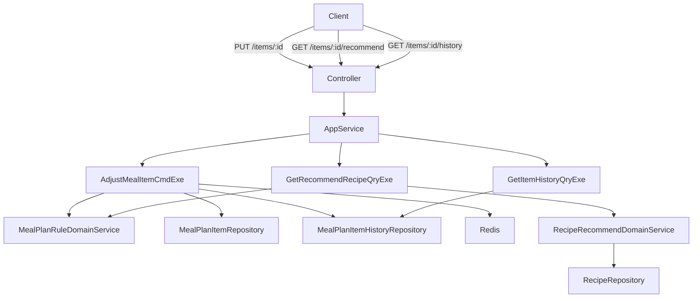

# UC4 Adjust Meal Item Design

## Background & Motivation

UC3 提供了简单的 `PUT /{planId}/items/{itemId}/replace` 接口，仅替换 recipeId 不做额外记录。用户反馈需要：1) 系统推荐替换候选；2) 记录调整原因和历史便于复盘；3) 调整后重校验不重样。UC4 将替换接口升级为带推荐、历史追溯和重校验的完整调整能力。

## Goal

- 替换成功率 100%（通过校验即可写入）
- 推荐接口 P95 < 200ms
- 替换接口 P95 < 300ms

## Non-Goal

- 批量替换多个餐次
- 替换后自动重新派生采购清单
- 历史记录的撤回/回滚
- 推荐算法的 ML 优化

## Architecture



数据流：
- 替换：Request → Controller → AppService → CmdExe → load item+plan → domain validate → update item → save history → evict cache → return CO
- 推荐：Request → Controller → AppService → QryExe → load plan items → extract used IDs → domain recommend → return CO list
- 历史：Request → Controller → AppService → QryExe → load history by itemId → return CO list

## Interface Contract

### PUT /api/meal-plans/{planId}/items/{itemId}

替换餐次菜品。替代 UC3 的 `/replace` 端点。

**Parameters:**
- `planId` (path, Long, required) — 周计划 ID
- `itemId` (path, Long, required) — 餐次明细 ID

**Request Body:**
```java
public class AdjustMealItemCmd {
    @NotNull Long planId;
    @NotNull Long itemId;
    @NotNull Long newRecipeId;
    String adjustReason; // nullable, enum: LACK_INGREDIENT|TASTE_CHANGE|OUTING|OTHER
}
```

**Response:** `SingleResponse<MealPlanItemCO>`
```java
public class MealPlanItemCO {
    Long itemId;
    String mealDate;       // yyyy-MM-dd
    String mealType;       // BREAKFAST|LUNCH|DINNER
    Long recipeId;
    String recipeName;
    String crowdType;      // ALL|ADULT|BABY
    Boolean weightLoss;
    Boolean manuallyAdjusted;
    Integer adjustCount;
}
```

**Error Codes:**
| errCode | HTTP | 条件 |
|---------|------|------|
| MEAL_PLAN_NOT_FOUND | 404 | planId 无效 |
| MEAL_PLAN_ITEM_NOT_FOUND | 404 | itemId 无效或不属于该 plan |
| RECIPE_NOT_FOUND | 404 | newRecipeId 无效 |
| RECIPE_DUPLICATE_IN_WEEK | 400 | 同 crowd_type 本周已使用 |
| MEAL_PLAN_FROZEN | 400 | 计划状态非 DRAFT |

**幂等性:** 非幂等（每次调用生成新 history 记录并 adjustCount++）

---

### GET /api/meal-plans/{planId}/items/{itemId}/recommend

获取替换菜品推荐列表。crowdType/mealType 从 itemId 推导。

**Parameters:**
- `planId` (path, Long, required)
- `itemId` (path, Long, required)

**Response:** `MultiResponse<RecipeBriefCO>`
```java
public class RecipeBriefCO {
    Long recipeId;
    String name;
    String recipeType;
    String seasonTag;
    String coverImageUrl;
    Integer cookTimeMinutes;
}
```

**Error Codes:** MEAL_PLAN_NOT_FOUND (404), MEAL_PLAN_ITEM_NOT_FOUND (404)

---

### GET /api/meal-plans/{planId}/items/{itemId}/history

查询餐次调整历史。

**Parameters:**
- `planId` (path, Long, required)
- `itemId` (path, Long, required)

**Response:** `MultiResponse<MealPlanItemHistoryCO>`
```java
public class MealPlanItemHistoryCO {
    Long historyId;
    String oldRecipeName;
    String newRecipeName;
    String adjustReason;
    String adjustedAt;     // yyyy-MM-dd HH:mm
}
```

**Error Codes:** MEAL_PLAN_ITEM_NOT_FOUND (404)

## Data Model

### meal_plan_item 新增字段

| 字段 | 类型 | 默认值 | 说明 |
|------|------|--------|------|
| is_manually_adjusted | TINYINT | 0 | 是否已手动调整 |
| adjust_count | INT | 0 | 累计调整次数 |

### meal_plan_item_history（新表）

| 字段 | 类型 | 约束 | 说明 |
|------|------|------|------|
| id | BIGINT | PK, AUTO_INCREMENT | 主键 |
| item_id | BIGINT | NOT NULL, idx | 餐次明细 ID |
| plan_id | BIGINT | NOT NULL, idx | 周计划 ID（冗余） |
| old_recipe_id | BIGINT | NULL | 调整前菜品 ID |
| new_recipe_id | BIGINT | NOT NULL | 调整后菜品 ID |
| adjust_reason | VARCHAR(64) | NULL | 调整原因枚举 |
| adjusted_at | DATETIME | DEFAULT CURRENT_TIMESTAMP | 调整时间 |
| adjusted_by | BIGINT | DEFAULT 0 | 操作人 |

**索引**: `idx_item_id(item_id)`, `idx_plan_id_date(plan_id, adjusted_at)`

## Non-Functional Requirements

> **搜索端点**：前端搜索 Tab 复用已有 `GET /api/recipes/search?keyword=xxx` 端点（RecipeController），不在 UC4 新增搜索接口。

| 维度 | 指标 |
|------|------|
| 性能 | 替换接口 P95 < 300ms；推荐接口 P95 < 200ms |
| 缓存 | 推荐列表缓存 10min，替换成功后失效 |
| 并发 | 同一 item 并发替换通过乐观锁（数据库层 UPDATE WHERE）避免脏写 |
| 可观测性 | 替换操作写 INFO 日志（planId, itemId, oldRecipeId, newRecipeId） |

## Error Handling

| 外部依赖 | 失败场景 | 处理策略 |
|----------|----------|----------|
| MySQL | 写入 history 失败 | 事务回滚，替换不生效，返回 500 |
| Redis | 缓存删除失败 | 记 WARN 日志，不影响业务返回（缓存有 TTL 兜底） |
| RecipeRepository | 查询菜品不存在 | 返回 RECIPE_NOT_FOUND 404 |

## Alternatives Considered

| 方案 | 优点 | 缺点 | 不选原因 |
|------|------|------|----------|
| 保留 UC3 `/replace` + 新增 `/adjust` | 向后兼容 | 两个替换入口混乱 | 统一入口更清晰 |
| history 放在 MealPlanItem 的 JSON 字段 | 免建表 | 查询不便、无法索引 | 违反数据库范式 |
| 推荐结果按 itemId 单独缓存 | 缓存命中率高 | 任意调整后所有 item 缓存均需失效 | 按周粒度更简单 |

## Testing Strategy

| 测试对象 | 层级 | 关键用例 |
|----------|------|----------|
| MealPlanRuleDomainService.validateNoDuplicate | 单元 | 同 crowd 重复拒绝、不同 crowd 允许、排除自身 |
| RecipeRecommendDomainService.recommend | 单元 | 排除已用、季节匹配排序、空候选 |
| MealPlanItem.adjust() | 单元 | adjustCount 递增、manuallyAdjusted 标记 |
| AdjustMealItemCmdExe | 集成 | 正常替换全链路、重复拒绝、FROZEN 拒绝 |
| GetRecommendRecipeQryExe | 集成 | 推荐排除已用、从 itemId 推导上下文 |
| GetItemHistoryQryExe | 集成 | 有记录返回、空记录返回 |
| PUT /items/{itemId} | 集成 | HTTP 200/400/404、缓存失效 |
