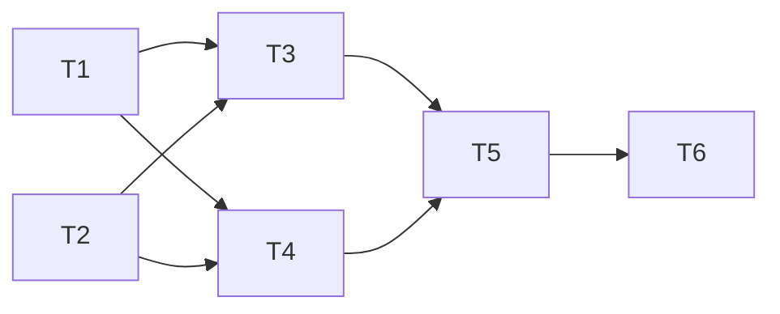

# UC4 Adjust Meal Item Implementation Plan

**Goal:** 实现餐次菜品替换（含推荐、历史、不重样校验）的后端全链路
**Architecture:** 新增 MealPlanItemHistory 实体 + 2 个领域服务 + 3 个执行器 + 3 个 Controller 端点，走 COLA adapter→app→domain→infra 标准链路
**Tech Stack:** Spring Boot 3.3, MyBatis-Plus, Redis, MapStruct, JUnit 5

## Dependency Graph



| Task | 依赖 | 可并行组 |
|------|------|---------|
| T1: DB Migration | 无 | A |
| T2: Domain 实体与仓储接口 | 无 | A |
| T3: Domain 规则服务 | T1, T2 | B |
| T4: Infra 持久化 | T1, T2 | B |
| T5: App 执行器 | T3, T4 | C |
| T6: Adapter Controller | T5 | D |

---

### Task 1: DB Migration

**Depends on:** 无
**Files:**
- Create: `mealmate-start/src/main/resources/db/migration/V6__add_adjust_meal_item.sql`

**Behavior:** 新增 meal_plan_item 两个字段 + 创建 meal_plan_item_history 表。

- [ ] **Step 1: Write migration script**

```sql
ALTER TABLE `meal_plan_item`
  ADD COLUMN `is_manually_adjusted` TINYINT NOT NULL DEFAULT 0 COMMENT '是否已手动调整',
  ADD COLUMN `adjust_count` INT NOT NULL DEFAULT 0 COMMENT '累计调整次数';

CREATE TABLE IF NOT EXISTS `meal_plan_item_history` (
  `id` BIGINT NOT NULL AUTO_INCREMENT,
  `item_id` BIGINT NOT NULL,
  `plan_id` BIGINT NOT NULL,
  `old_recipe_id` BIGINT DEFAULT NULL,
  `new_recipe_id` BIGINT NOT NULL,
  `adjust_reason` VARCHAR(64) DEFAULT NULL,
  `adjusted_at` DATETIME NOT NULL DEFAULT CURRENT_TIMESTAMP,
  `adjusted_by` BIGINT NOT NULL DEFAULT 0,
  PRIMARY KEY (`id`),
  KEY `idx_item_id` (`item_id`),
  KEY `idx_plan_id_date` (`plan_id`, `adjusted_at`)
) ENGINE=InnoDB DEFAULT CHARSET=utf8mb4 COLLATE=utf8mb4_unicode_ci;
```

- [ ] **Step 2: Verify**

Run: `./mvnw clean compile -pl mealmate-start -am`
Expected: PASS

- [ ] **Step 3: Commit**

```bash
git add mealmate-start/src/main/resources/db/migration/V6__add_adjust_meal_item.sql
git commit -m "feat(mealplan): 添加餐次调整历史表和字段迁移脚本"
```

---

### Task 2: Domain 实体与仓储接口

**Depends on:** 无
**Files:**
- Modify: `mealmate-domain/src/main/java/io/yggdrasil/labs/mealmate/domain/mealplan/model/MealPlanItem.java`
- Create: `mealmate-domain/src/main/java/io/yggdrasil/labs/mealmate/domain/mealplan/model/MealPlanItemHistory.java`
- Create: `mealmate-domain/src/main/java/io/yggdrasil/labs/mealmate/domain/mealplan/model/enums/AdjustReason.java`
- Create: `mealmate-domain/src/main/java/io/yggdrasil/labs/mealmate/domain/mealplan/repo/MealPlanItemHistoryRepository.java`
- Test: `mealmate-domain/src/test/java/io/yggdrasil/labs/mealmate/domain/mealplan/model/MealPlanItemTest.java`

**Behavior:** MealPlanItem 补充 adjust 字段和行为方法；新增 History 实体和仓储接口。

- [ ] **Step 1: Write failing test**

```java
@Test
void adjustShouldIncrementCountAndMarkManual() {
    MealPlanItem item = MealPlanItem.builder().id(1L).recipeId(100L).build();
    item.adjust(200L);
    assertEquals(200L, item.getRecipeId());
    assertTrue(item.isManuallyAdjusted());
    assertEquals(1, item.getAdjustCount());
}

@Test
void adjustTwiceShouldIncrementToTwo() {
    MealPlanItem item = MealPlanItem.builder().id(1L).recipeId(100L).build();
    item.adjust(200L);
    item.adjust(300L);
    assertEquals(2, item.getAdjustCount());
}
```

- [ ] **Step 2: Implement**

MealPlanItem: 新增 `manuallyAdjusted(boolean)`, `adjustCount(int)` 字段 + `adjust(Long newRecipeId)` 方法。
MealPlanItemHistory: 简单值对象（id, itemId, planId, oldRecipeId, newRecipeId, adjustReason, adjustedAt, adjustedBy）。
AdjustReason: 枚举 LACK_INGREDIENT, TASTE_CHANGE, OUTING, OTHER。
MealPlanItemHistoryRepository: 接口声明 `save(MealPlanItemHistory)` + `findByItemId(Long itemId)`.

- [ ] **Step 3: Verify**

Run: `./mvnw test -pl mealmate-domain -am -Dtest=MealPlanItemTest`
Expected: PASS

- [ ] **Step 4: Commit**

```bash
git add mealmate-domain/
git commit -m "feat(mealplan): 领域层新增调整历史实体和行为方法"
```

---

### Task 3: Domain 规则服务

**Depends on:** T2
**Files:**
- Create: `mealmate-domain/src/main/java/io/yggdrasil/labs/mealmate/domain/mealplan/service/MealPlanRuleDomainService.java`
- Create: `mealmate-domain/src/main/java/io/yggdrasil/labs/mealmate/domain/mealplan/service/RecipeRecommendDomainService.java`
- Test: `mealmate-domain/src/test/java/io/yggdrasil/labs/mealmate/domain/mealplan/service/MealPlanRuleDomainServiceTest.java`
- Test: `mealmate-domain/src/test/java/io/yggdrasil/labs/mealmate/domain/mealplan/service/RecipeRecommendDomainServiceTest.java`

**Behavior:** 不重样校验（同 crowd + 同周）+ 推荐筛选排序（排除已用、匹配 crowd/season）。

- [ ] **Step 1: Write failing test**

```java
// MealPlanRuleDomainServiceTest
@Test
void shouldRejectDuplicateInSameCrowd() {
    // plan 中已有 ALL 餐次使用 recipeId=200
    // validateNoDuplicate 应抛出 BizException
}

@Test
void shouldAllowSameRecipeForDifferentCrowd() {
    // plan 中 ALL 使用 recipeId=200，BABY 替换为 200 应通过
}

@Test
void shouldExcludeSelfWhenValidating() {
    // itemId=10 当前就是 recipeId=200，替换为 200（同菜品）应通过
}
```

- [ ] **Step 2: Implement**

```java
// MealPlanRuleDomainService 伪代码：
//   1. 从 plan.items 提取同 crowdType 的所有 recipeId（排除当前 itemId）
//   2. 若 newRecipeId 在集合中 → 抛 BizException(RECIPE_DUPLICATE_IN_WEEK)

// RecipeRecommendDomainService 伪代码：
//   1. 接收 crowdType, mealType, usedRecipeIds, season
//   2. 调用 RecipeRepository.findByCrowdAndSeasonExcluding(...)
//   3. 按季节匹配度排序，返回 top 20
```

- [ ] **Step 3: Verify**

Run: `./mvnw test -pl mealmate-domain -am -Dtest="MealPlanRuleDomainServiceTest+RecipeRecommendDomainServiceTest"`
Expected: PASS

- [ ] **Step 4: Commit**

```bash
git add mealmate-domain/
git commit -m "feat(mealplan): 实现不重样校验和推荐领域服务"
```

---

### Task 4: Infra 持久化

**Depends on:** T2
**Files:**
- Create: `mealmate-infrastructure/src/main/java/io/yggdrasil/labs/mealmate/infrastructure/persistence/mealplan/dataobject/MealPlanItemHistoryDO.java`
- Create: `mealmate-infrastructure/src/main/java/io/yggdrasil/labs/mealmate/infrastructure/persistence/mealplan/mapper/MealPlanItemHistoryMapper.java`
- Create: `mealmate-infrastructure/src/main/java/io/yggdrasil/labs/mealmate/infrastructure/persistence/mealplan/repo/MealPlanItemHistoryRepositoryImpl.java`
- Modify: `mealmate-infrastructure/src/main/java/io/yggdrasil/labs/mealmate/infrastructure/persistence/mealplan/convertor/MealPlanInfraConvertor.java`
- Modify: `mealmate-infrastructure/src/main/java/io/yggdrasil/labs/mealmate/infrastructure/persistence/mealplan/dataobject/MealPlanItemDO.java`

**Behavior:** History 表的 DO/Mapper/Repository 实现 + MealPlanItemDO 补 2 个新字段 + MapStruct convertor 补 history 转换。RecipeRepository 补充 `findByCrowdAndSeasonExcluding()` 查询方法。

- [ ] **Step 1: Implement**

DO/Mapper/RepositoryImpl 为标准 MyBatis-Plus CRUD，省略代码。
MealPlanInfraConvertor 补充 `toHistory(MealPlanItemHistory) → MealPlanItemHistoryDO` 和反向映射。
MealPlanItemDO 补 `isManuallyAdjusted`, `adjustCount` 字段。

- [ ] **Step 2: Verify**

Run: `./mvnw clean compile -pl mealmate-infrastructure -am`
Expected: PASS

- [ ] **Step 3: Commit**

```bash
git add mealmate-infrastructure/
git commit -m "feat(mealplan): 基础设施层实现调整历史持久化"
```

---

### Task 5: App 执行器

**Depends on:** T3, T4
**Files:**
- Create: `mealmate-app/src/main/java/io/yggdrasil/labs/mealmate/app/mealplan/dto/cmd/AdjustMealItemCmd.java`
- Create: `mealmate-app/src/main/java/io/yggdrasil/labs/mealmate/app/mealplan/dto/qry/GetRecommendRecipeQry.java`
- Create: `mealmate-app/src/main/java/io/yggdrasil/labs/mealmate/app/mealplan/dto/qry/GetItemHistoryQry.java`
- Create: `mealmate-app/src/main/java/io/yggdrasil/labs/mealmate/app/mealplan/dto/co/RecipeBriefCO.java`
- Create: `mealmate-app/src/main/java/io/yggdrasil/labs/mealmate/app/mealplan/dto/co/MealPlanItemHistoryCO.java`
- Create: `mealmate-app/src/main/java/io/yggdrasil/labs/mealmate/app/mealplan/executor/AdjustMealItemCmdExe.java`
- Create: `mealmate-app/src/main/java/io/yggdrasil/labs/mealmate/app/mealplan/executor/GetRecommendRecipeQryExe.java`
- Create: `mealmate-app/src/main/java/io/yggdrasil/labs/mealmate/app/mealplan/executor/GetItemHistoryQryExe.java`
- Modify: `mealmate-app/src/main/java/io/yggdrasil/labs/mealmate/app/mealplan/application/MealPlanAppService.java`

**Behavior:** 三个执行器编排领域服务和仓储，AppService 新增 3 个入口方法。

- [ ] **Step 1: Write failing test**

```java
// AdjustMealItemCmdExe 集成测试关键断言：
// 1. 正常替换 → item.recipeId 已更新 + history 记录存在
// 2. 重复菜品 → BizException(RECIPE_DUPLICATE_IN_WEEK)
// 3. CONFIRMED 状态 → BizException(MEAL_PLAN_FROZEN)
```

- [ ] **Step 2: Implement**

```java
// AdjustMealItemCmdExe.execute(cmd) 伪代码：
//   1. itemRepo.loadWithPlan(cmd.itemId) → item + plan
//   2. 校验 plan.status == DRAFT，否则 throw MEAL_PLAN_FROZEN
//   3. recipeRepo.findById(cmd.newRecipeId)，不存在 throw RECIPE_NOT_FOUND
//   4. ruleDomainService.validateNoDuplicate(plan, item.id, cmd.newRecipeId)
//   5. Long oldRecipeId = item.getRecipeId()
//   6. item.adjust(cmd.newRecipeId)
//   7. itemRepo.update(item)
//   8. historyRepo.save(new History(item.id, plan.id, oldRecipeId, cmd.newRecipeId, cmd.adjustReason))
//   9. redis.delete("mealmate:mealplan:week:" + plan.familyId + ":" + plan.weekStartDate)
//  10. redis.delete("mealmate:mealplan:recommend:" + plan.familyId + ":" + plan.weekStartDate)
//  11. return assembler.toMealPlanItemCO(item)
```

- [ ] **Step 3: Verify**

Run: `./mvnw test -pl mealmate-app -am`
Expected: PASS

- [ ] **Step 4: Commit**

```bash
git add mealmate-app/
git commit -m "feat(mealplan): 应用层实现调整/推荐/历史三个执行器"
```

---

### Task 6: Adapter Controller

**Depends on:** T5
**Files:**
- Modify: `mealmate-adapter/src/main/java/io/yggdrasil/labs/mealmate/adapter/web/mealplan/MealPlanController.java`

**Behavior:** 新增 3 个端点，替换已有的 `/replace` 端点。

- [ ] **Step 1: Write failing test**

```java
// Controller 集成测试：
// PUT /api/meal-plans/1/items/10 → 200 + body.data.manuallyAdjusted == true
// PUT /api/meal-plans/1/items/10 (duplicate) → 400 + errCode
// GET /api/meal-plans/1/items/10/recommend → 200 + list not contains usedIds
// GET /api/meal-plans/1/items/10/history → 200 + list size matches
```

- [ ] **Step 2: Implement**

Controller 新增 3 个方法：adjustItem (PUT), getRecommendRecipes (GET), getItemHistory (GET)。
移除或标记废弃旧的 `replaceItem` 端点。

- [ ] **Step 3: Verify**

Run: `./mvnw clean verify`
Expected: PASS

- [ ] **Step 4: Commit**

```bash
git add mealmate-adapter/
git commit -m "feat(mealplan): Controller 新增调整/推荐/历史端点"
```

---

## 风险与阻塞

| 风险 | 影响 | 缓解措施 |
|------|------|----------|
| UC3 基础表/实体尚未合入 main | 高 | UC4 从 UC3 分支拉出，已包含 UC3 代码 |
| 旧 /replace 端点有调用方 | 低 | 保留但标记 @Deprecated，下版本删除 |

## 完成标准

- [ ] 所有 Task checkpoint 勾选
- [ ] `./mvnw clean verify` 全量通过
- [ ] 集成测试覆盖：正常替换、重复拒绝、FROZEN 拒绝、推荐排除、历史查询、连续调整
- [ ] design.md status 更新为 verified
